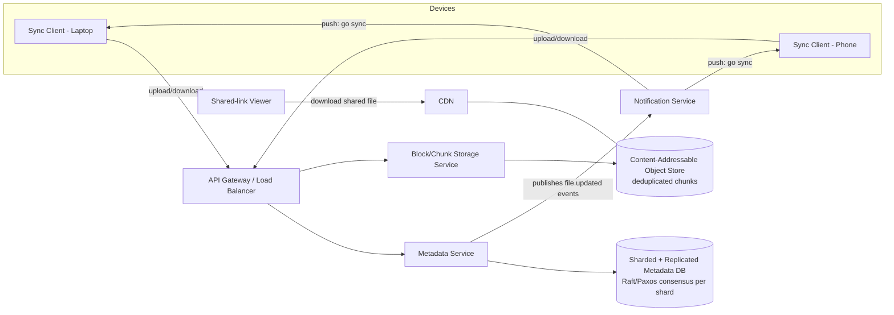
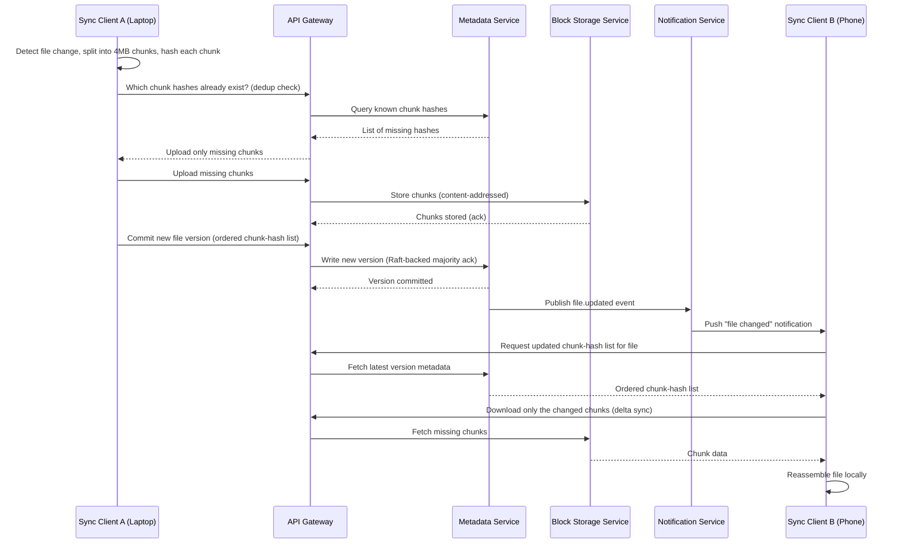

# Diagrams: Distributed File Storage System (Google Drive/Dropbox)

## ১. সামগ্রিক Architecture

*Caption: metadata service (strongly consistent, sharded/replicated) এবং block storage service (deduplicated, eventually consistent) আলাদা service; notification service change event push করে যাতে অন্যান্য device polling ছাড়াই sync করে, এবং একটি CDN hot shared-file download-এর সামনে বসে।*

## ২. Sequence: একটি পরিবর্তিত File Upload এবং অন্য Device-এ Sync করা

*Caption: initial upload (dedup) এবং দ্বিতীয় device-এ sync (delta sync) -- উভয় ক্ষেত্রেই শুধুমাত্র missing/পরিবর্তিত chunk transfer হয় -- আর notification service device B-তে near real time-এ update দৃশ্যমান করে তোলে।*
