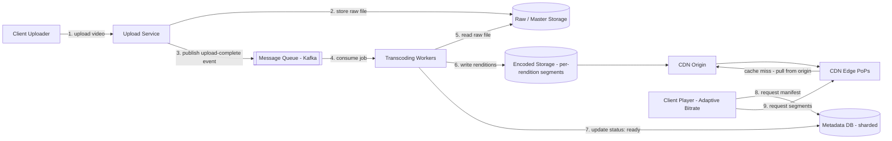
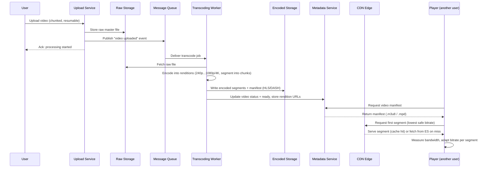

# ডায়াগ্রাম: একটি ভিডিও স্ট্রিমিং প্ল্যাটফর্ম ডিজাইন করা (YouTube/Netflix-এর মতো)

[README.md](README.md)-এর সাথে যুক্ত companion ডায়াগ্রাম।

## ১. সামগ্রিক আর্কিটেকচার (Overall Architecture)

Upload, transcoding, storage, metadata, এবং client player-এ CDN delivery।

*ক্যাপশন: Upload একটি queue-এর মাধ্যমে asynchronously distributed transcoding worker-দের মধ্যে প্রবাহিত হয়, অন্যদিকে playback read প্রায় সম্পূর্ণভাবে CDN edge cache থেকে সার্ভ করা হয়।*

## ২. Upload-থেকে-Playback-Ready সিকোয়েন্স

একজন ব্যবহারকারীর আপলোড থেকে ভিডিওটি streamable হয়ে ওঠা পর্যন্ত end-to-end pipeline।

*ক্যাপশন: Upload এবং transcoding path একটি queue দ্বারা asynchronous এবং decoupled, তাই playback readiness upload সময়ের নয়, বরং transcoding সময়ের সমান পিছিয়ে থাকে।*
</content>
