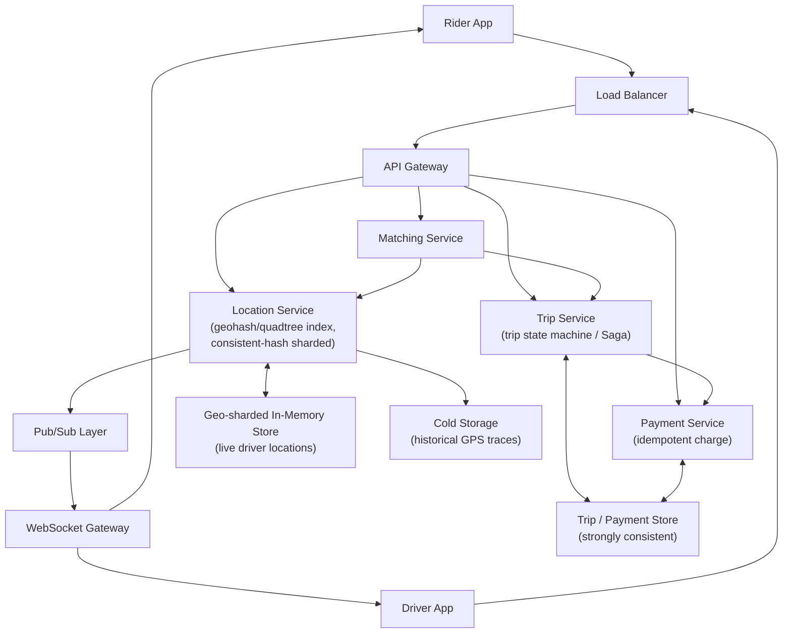
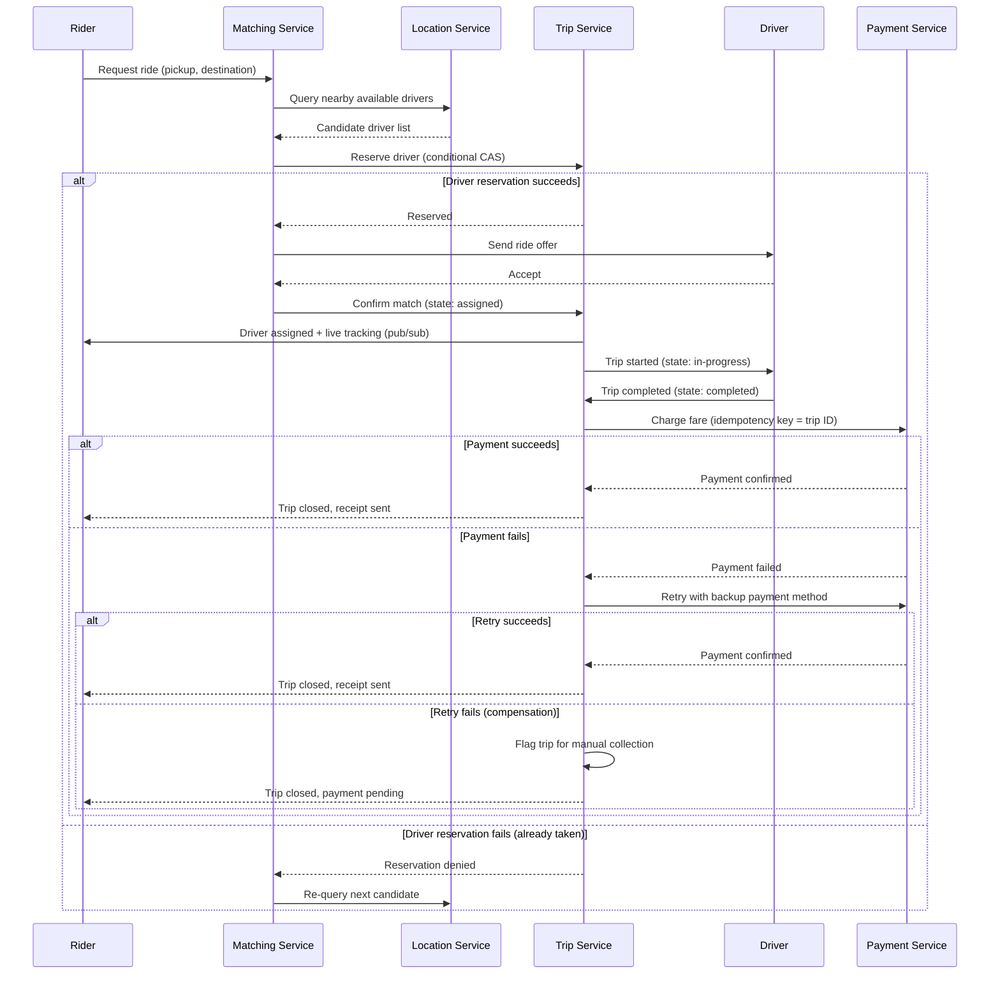

# Diagrams: Ride-Sharing System (Uber-এর মতো)

## ১. সামগ্রিক আর্কিটেকচার (Overall Architecture)

*Rider এবং driver app একটি load balancer এবং API gateway-এর মাধ্যমে backend-এ পৌঁছায়; Location Service (geohash + consistent hashing) live position একটি geo-sharded cache এবং একটি pub/sub layer উভয়কেই ফিড করে, যা WebSocket-এর মাধ্যমে real-time update push করে, এবং একই সময়ে Trip ও Payment service trip/payment state একটি strongly-consistent store-এ রাখে।*

## ২. Ride Request → Match → Trip → Payment Saga (Compensation সহ)

*Trip-টিকে local transaction-এর একটি Saga হিসেবে সমন্বয় করা হয় — driver সংরক্ষণ, match নিশ্চিতকরণ, trip পরিচালনা, payment charge — payment ব্যর্থ হলে একটি compensating retry/flag-for-collection path সহ, এবং প্রাথমিক driver reservation প্রত্যাখ্যাত হলে একটি re-match path সহ।*
