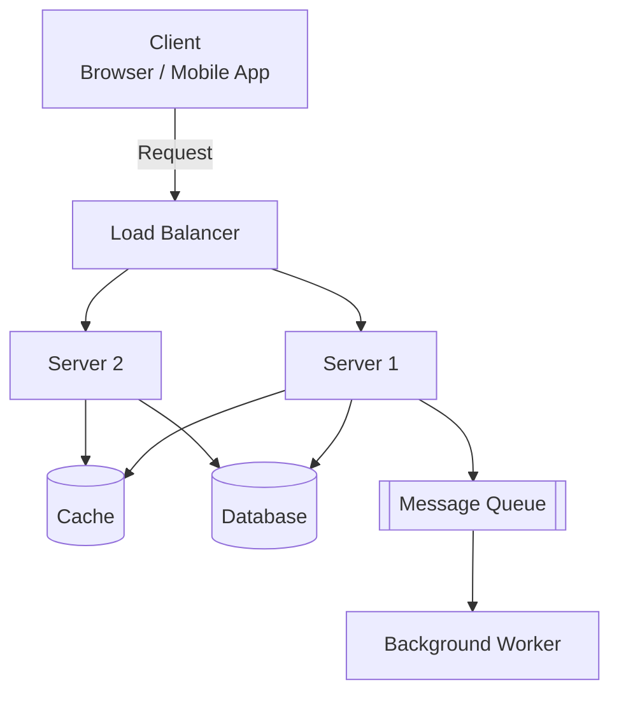
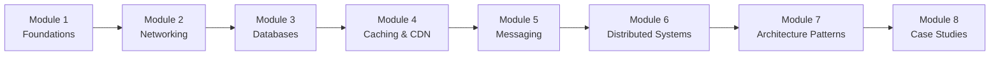

# Diagrams: What is System Design?

## 1. From Code to Architecture

```mermaid
flowchart LR
    A[Single Function\n\"Write correct code\"] --> B[Single Service\n\"Combine functions into an app\"]
    B --> C[Full System\n\"Clients, servers, DB, cache, queue working together\"]
    C --> D[System Design\n\"How do all pieces fit & scale?\"]
```
*Caption: System design zooms out from individual code to how entire systems of components fit together.*

## 2. Core Building Blocks of a Typical System


*Caption: The recurring cast of characters — client, load balancer, servers, cache, database, and message queue — that this entire course will explain piece by piece.*

## 3. Course Roadmap Flow


*Caption: Each module builds directly on the vocabulary and concepts introduced in the previous one.*
