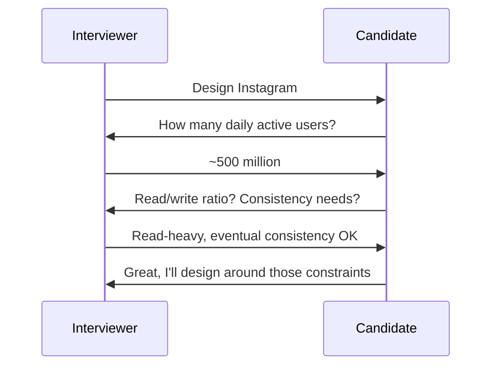
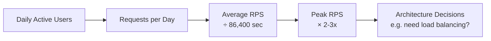

# Diagrams: Functional vs Non-Functional Requirements

## 1. Requirements Split

```mermaid
flowchart TD
    R[Gather Requirements] --> F[Functional Requirements\n\"What it does\"]
    R --> N[Non-Functional Requirements\n\"How well it does it\"]
    F --> F1[Upload photo]
    F --> F2[Follow user]
    F --> F3[View feed]
    N --> N1[Latency < 300ms]
    N --> N2[99.99% availability]
    N --> N3[500M DAU scalability]
```
*Caption: Every design starts by splitting requirements into what the system does versus how well it must do it.*

## 2. Requirements Gathering Flow in an Interview


*Caption: Clarifying questions turn a vague prompt into concrete, design-driving requirements before any architecture is proposed.*

## 3. Back-of-the-Envelope Estimation Pipeline


*Caption: A simple chain of multiplication and division turns "lots of users" into concrete numbers that drive real design decisions.*
