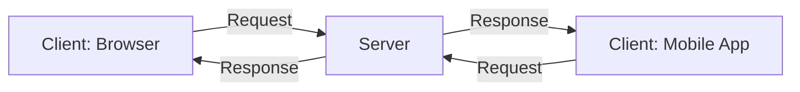
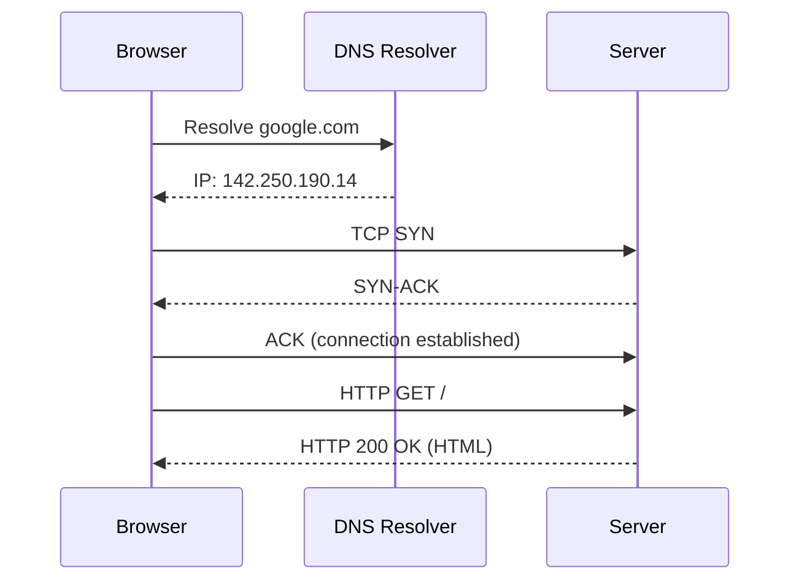
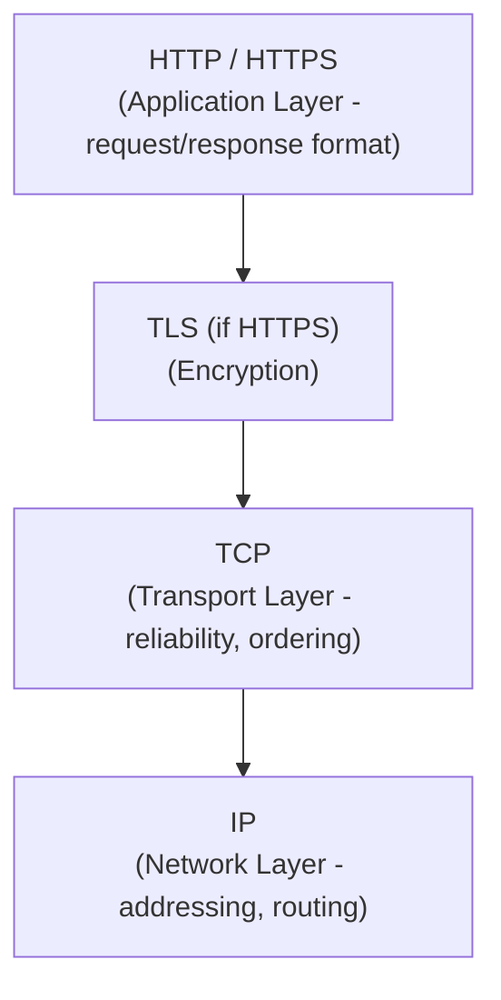

# Diagrams: Client-Server Architecture & How the Internet Works

## 1. Client-Server Model

*Caption: Multiple clients send requests to a server, which processes them and sends back responses.*

## 2. Full Request Sequence: URL to Page

*Caption: The full journey from typing a URL to receiving a page: DNS lookup, TCP handshake, then HTTP exchange.*

## 3. TCP/IP and HTTP Layering

*Caption: HTTP rides on top of TCP/IP — IP handles addressing and routing, TCP adds reliability, and HTTP defines the message format.*
