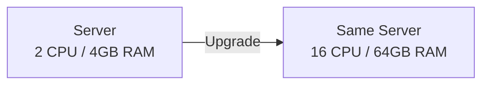
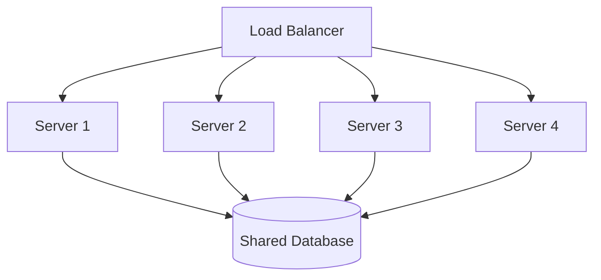
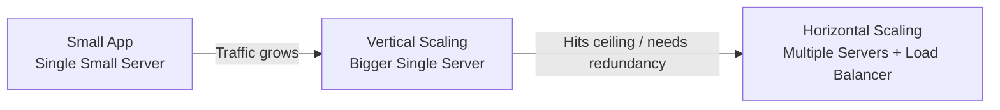

# Diagrams: Scalability Basics — Vertical vs Horizontal Scaling

## 1. Vertical Scaling

*Caption: Vertical scaling replaces a machine with a more powerful version of itself — same single point of failure remains.*

## 2. Horizontal Scaling

*Caption: Horizontal scaling adds more machines behind a load balancer, all sharing a common data store.*

## 3. Growth Path: Vertical First, Then Horizontal

*Caption: A typical scaling journey — start with vertical scaling for simplicity, transition to horizontal scaling as growth demands it.*
