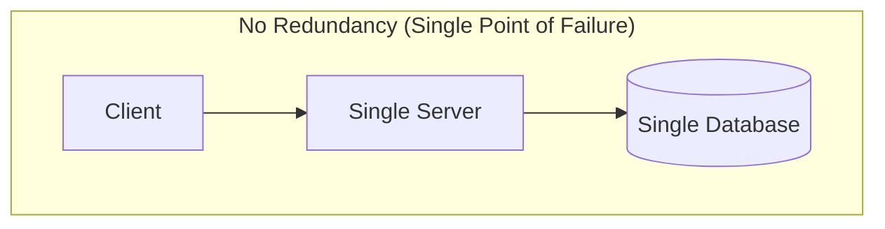
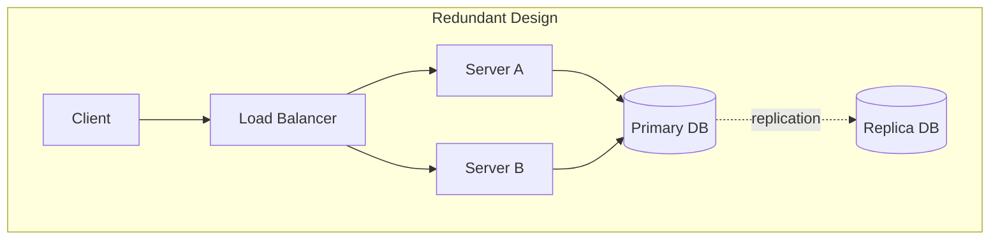
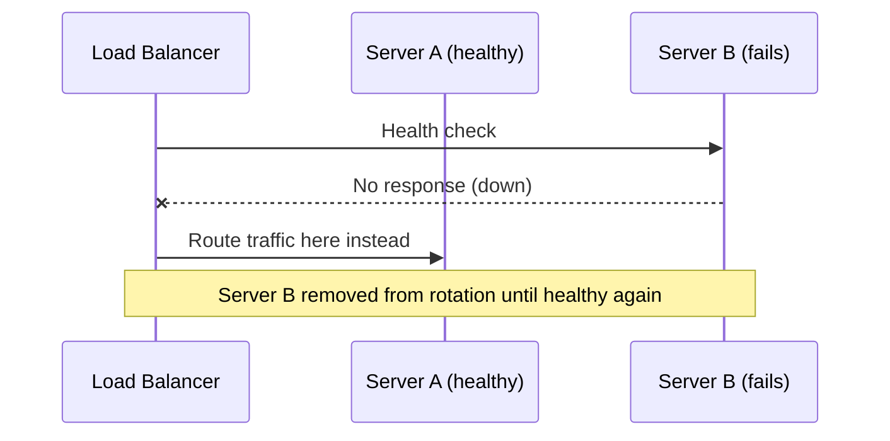
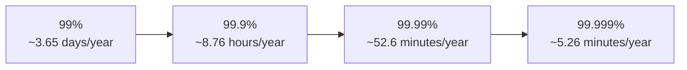

# Diagrams: Availability, Reliability, Redundancy & Fault Tolerance

## 1. Single Point of Failure vs Redundant Design

*Caption: A single server and single database mean any one failure takes the whole system down.*

*Caption: Redundant servers and a replicated database mean no single failure brings down the system.*

## 2. Failover Sequence via Health Checks

*Caption: Health checks let a load balancer detect a failed server and automatically fail traffic over to a healthy one.*

## 3. The Nines: Downtime Comparison

*Caption: Each additional "nine" of availability represents roughly a 10x reduction in allowed annual downtime.*
