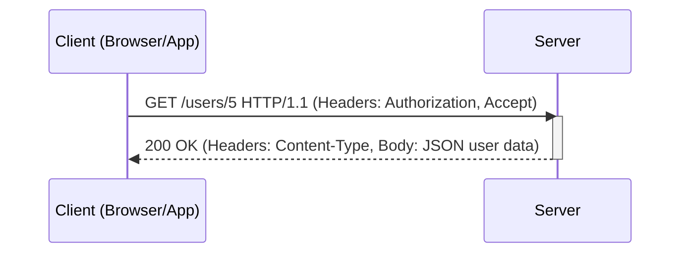
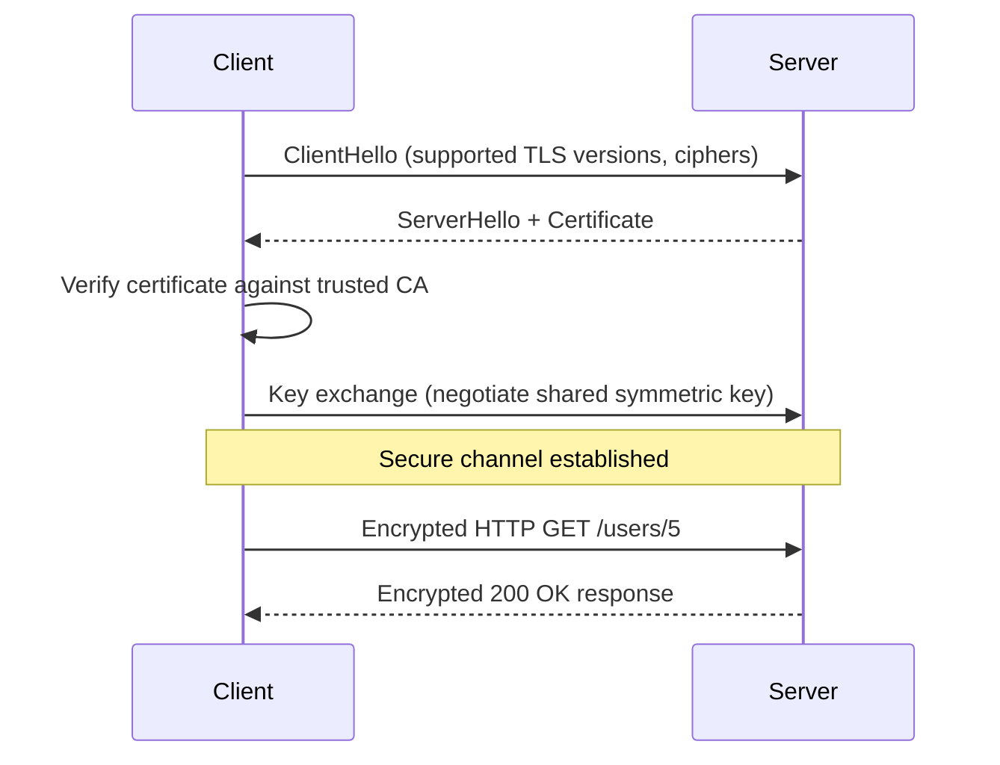
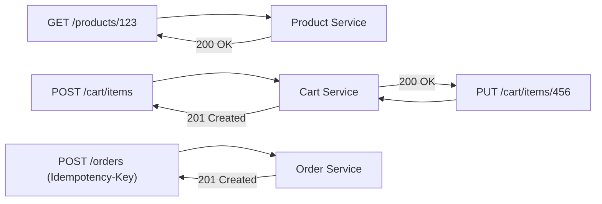

# Diagrams: HTTP/HTTPS & REST APIs

## 1. Basic HTTP Request-Response Cycle

*A client sends a stateless HTTP request and the server replies with a status code, headers, and a body — no memory of prior requests is kept.*

## 2. TLS Handshake Before an HTTPS Request

*HTTPS performs a TLS handshake once to authenticate the server and agree on encryption keys, then all HTTP traffic in that session is encrypted.*

## 3. REST Resource Model for an E-Commerce Checkout

*Each step of checkout maps to a resource and an HTTP method; POST /orders carries an idempotency key so retries don't create duplicate orders.*
