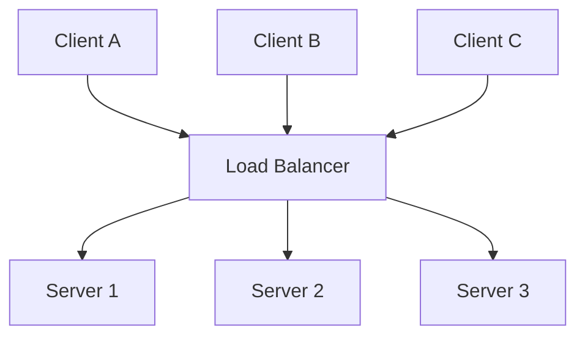
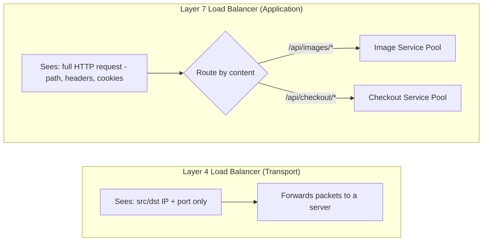
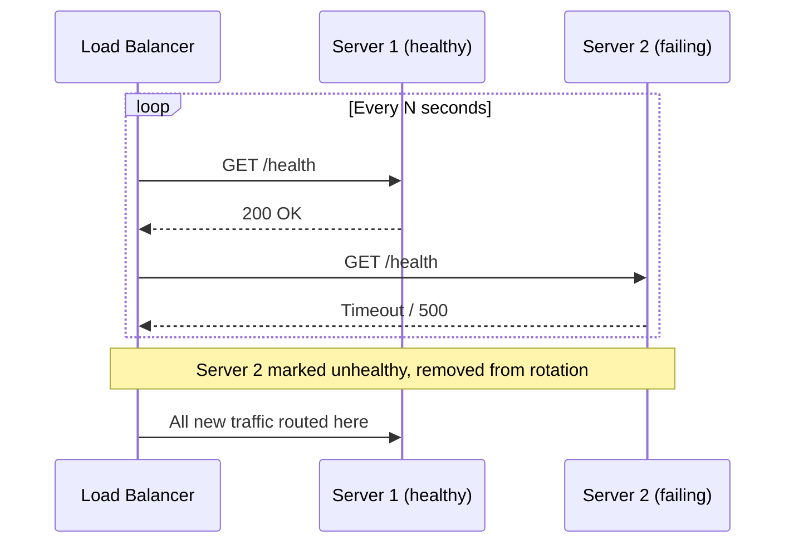

# Diagrams: Load Balancing

## 1. Basic Load Balancer Topology

*Clients only ever address the load balancer; it decides which backend server handles each request, hiding the fleet's size and topology.*

## 2. Layer 4 vs Layer 7 Decision Making

*L4 balancers move packets based on IP/port alone; L7 balancers understand HTTP and can route different paths to entirely different backend pools.*

## 3. Health Check Loop Removing a Failed Server

*The load balancer continuously probes backend health and silently reroutes traffic away from failing servers.*
