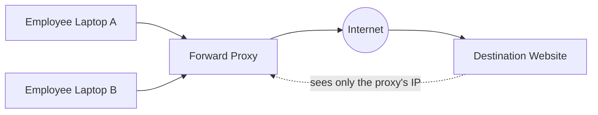
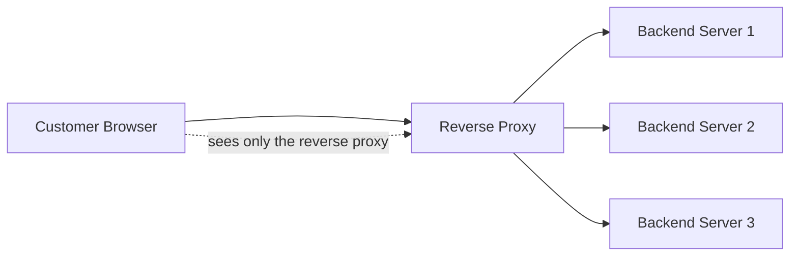
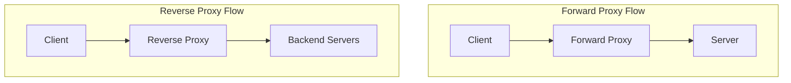

# Diagrams: Forward Proxy vs Reverse Proxy

## 1. Forward Proxy — Protecting the Client

*The destination server only ever sees the forward proxy's identity — it has no visibility into which specific client made the request.*

## 2. Reverse Proxy — Protecting the Server

*The client believes it's talking directly to "the server" — it never learns that a fleet of backend servers exists behind the reverse proxy.*

## 3. Side-by-Side: Same Traffic Path, Opposite Purpose

*Structurally identical — client, proxy, server — but the forward proxy is deployed by and represents the client side, while the reverse proxy is deployed by and represents the server side.*
