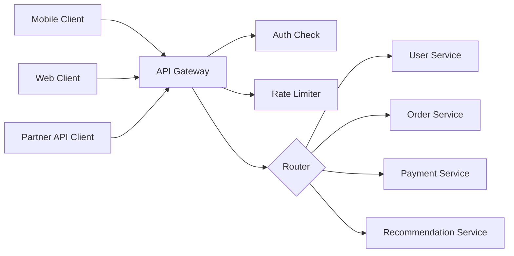
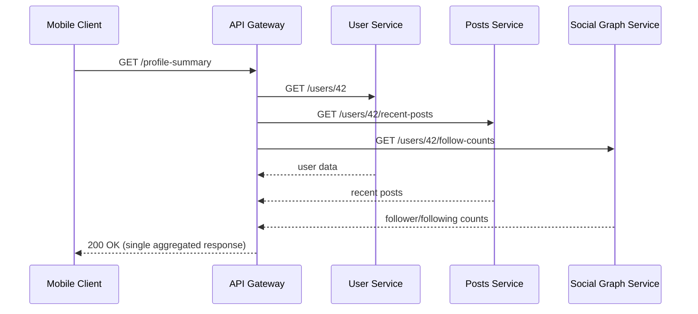
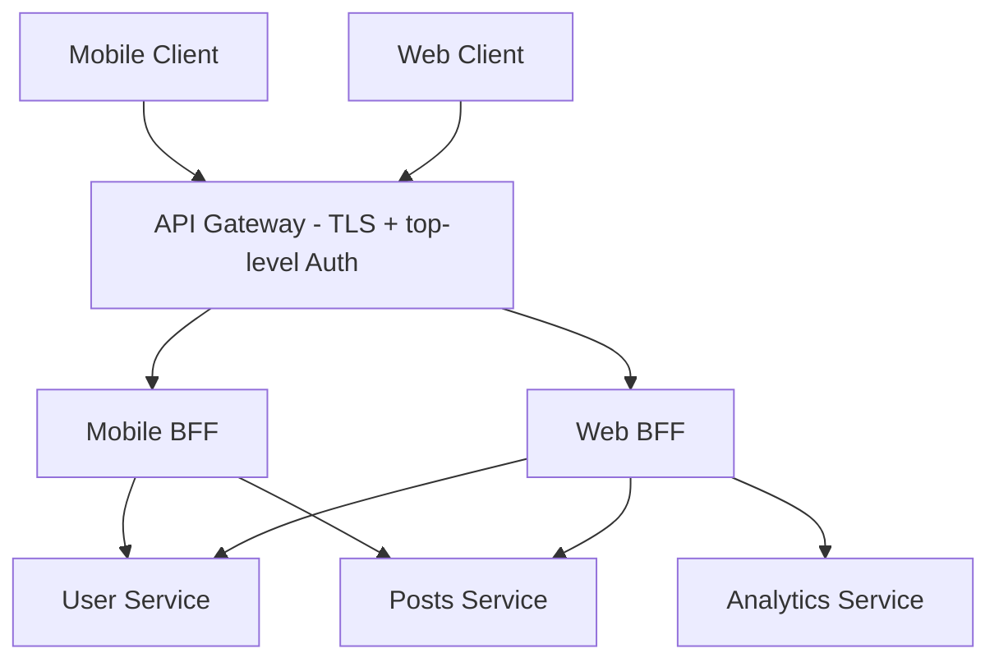

# Diagrams: API Gateway & Backend-for-Frontend

## 1. API Gateway in Front of a Microservices Architecture

*A single gateway centralizes authentication and rate limiting for every client before routing requests to the correct backend microservice.*

## 2. Request Aggregation at the Gateway

*The gateway fans out one client request into three fast internal calls, sparing the mobile client three separate slow round trips.*

## 3. API Gateway + Backend-for-Frontend Layers

*The gateway handles universal concerns for every client, then routes to a client-specific BFF that shapes and aggregates data exactly the way that client needs.*
