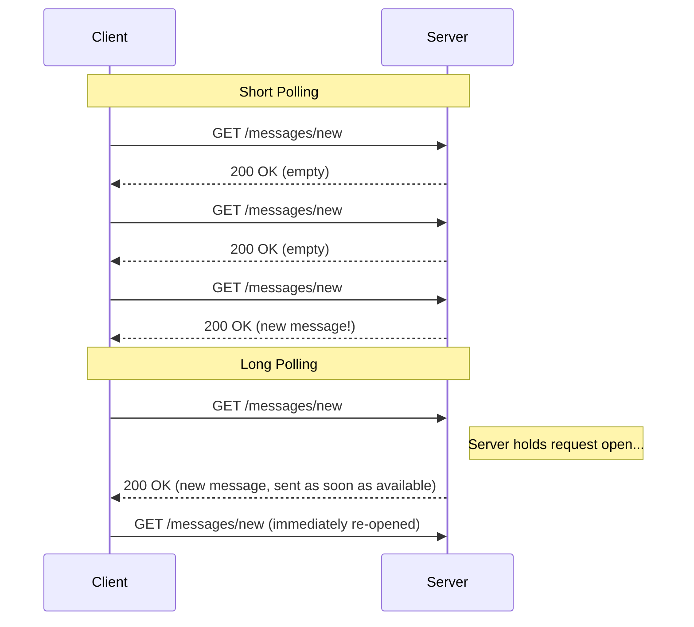
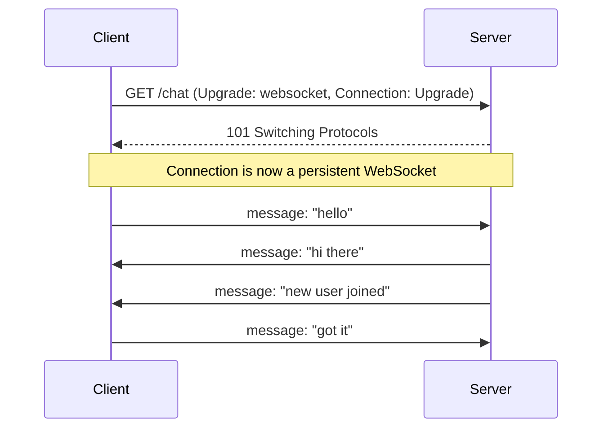

# Diagrams: WebSockets, Long Polling & Server-Sent Events

## 1. Short Polling vs Long Polling


*Short polling asks repeatedly regardless of whether there's new data; long polling holds the request open and responds the instant something arrives.*

## 2. Server-Sent Events — One Persistent, One-Way Stream

```mermaid
sequenceDiagram
    participant C as Client (EventSource)
    participant S as Server

    C->>S: GET /events (Accept: text/event-stream)
    activate S
    S-->>C: event: score_update, data: {...}
    S-->>C: event: score_update, data: {...}
    S-->>C: event: score_update, data: {...}
    deactivate S
    Note over C,S: Single connection stays open; server pushes events as they occur
```
*One HTTP connection stays open indefinitely while the server streams events down to the client; the client never sends data back over this channel.*

## 3. WebSocket Handshake and Full-Duplex Communication


*After the HTTP-to-WebSocket upgrade handshake, either side can send messages to the other at any time over the same persistent connection.*
