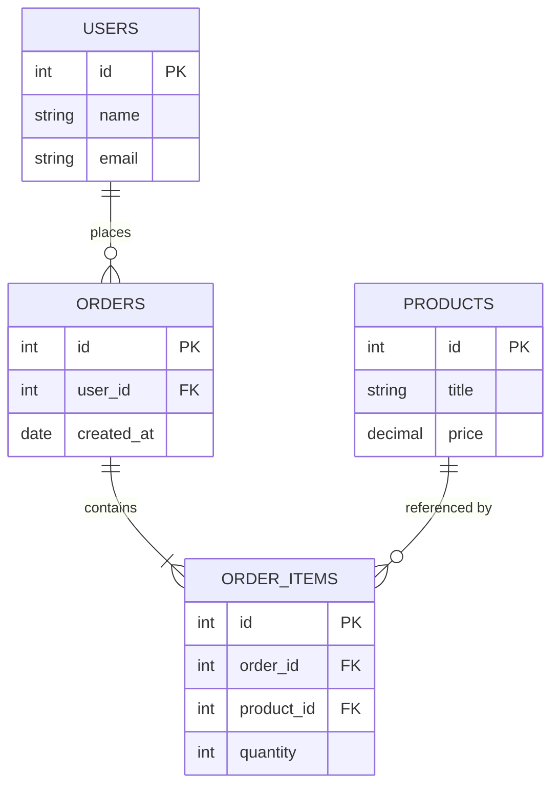
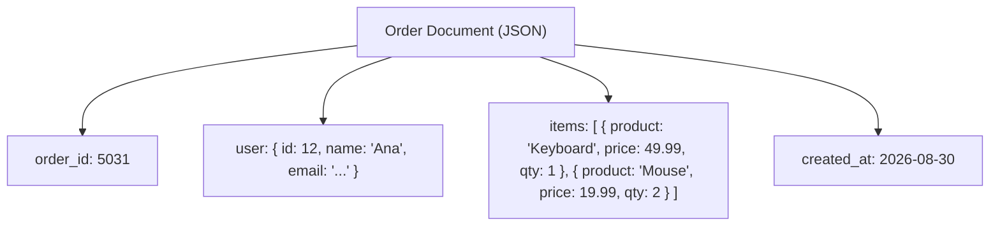
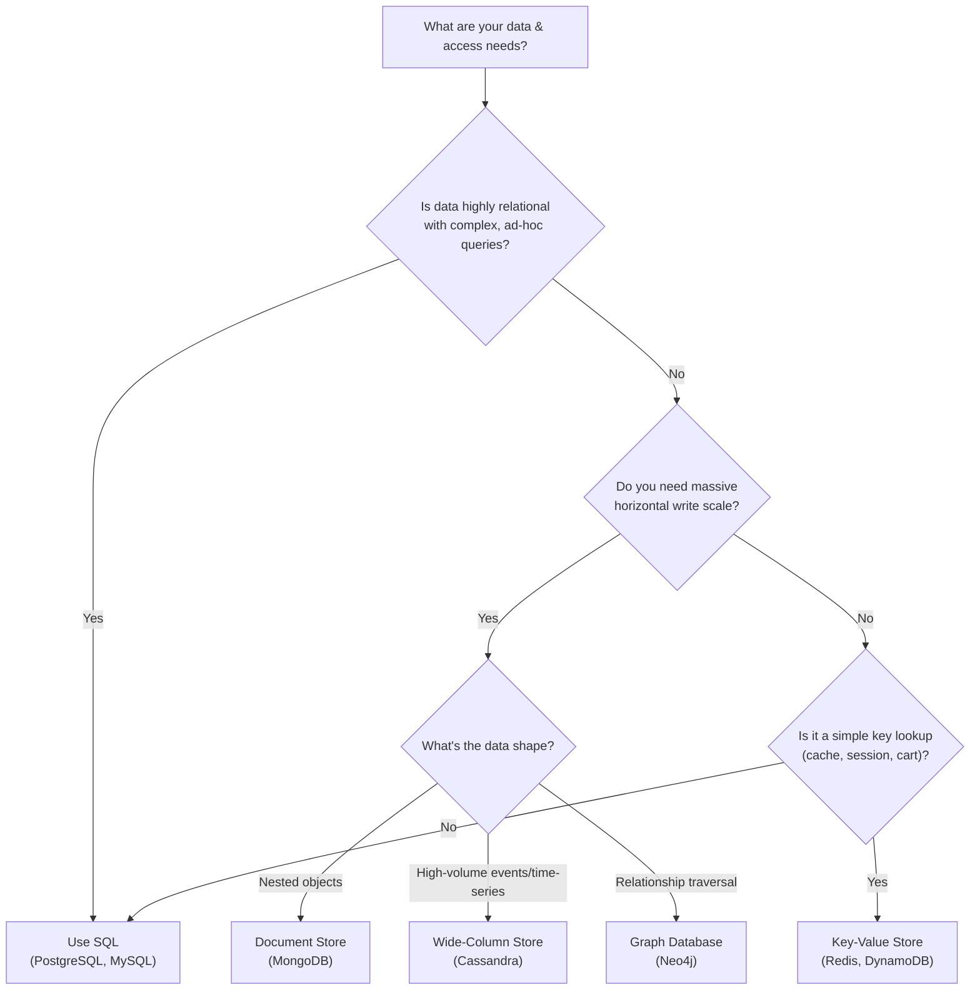

# Diagrams: SQL vs NoSQL

## 1. Relational Schema — Normalized with Foreign Keys

*Caption: A relational (SQL) schema stores each fact once and links tables with foreign keys, joined together at query time.*

## 2. Denormalized Document Structure (NoSQL)

*Caption: A document store embeds related data directly inside one record, trading duplication for a single fast read with no joins.*

## 3. Decision Tree: SQL vs NoSQL

*Caption: A practical decision path from data shape and scale requirements to a concrete database category.*
