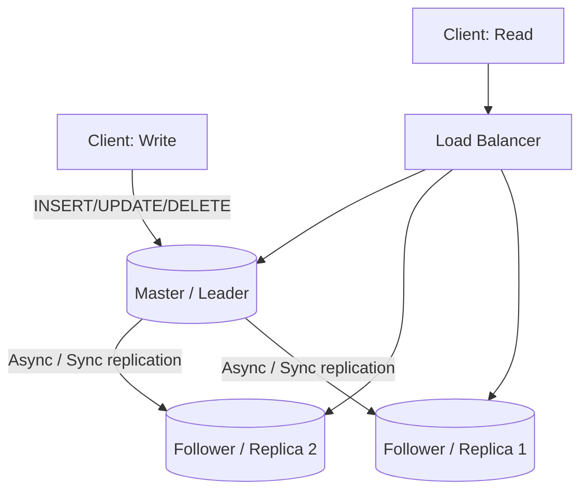
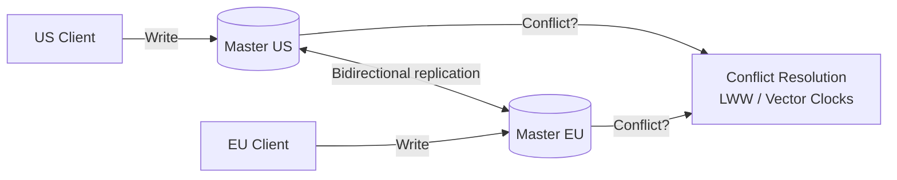
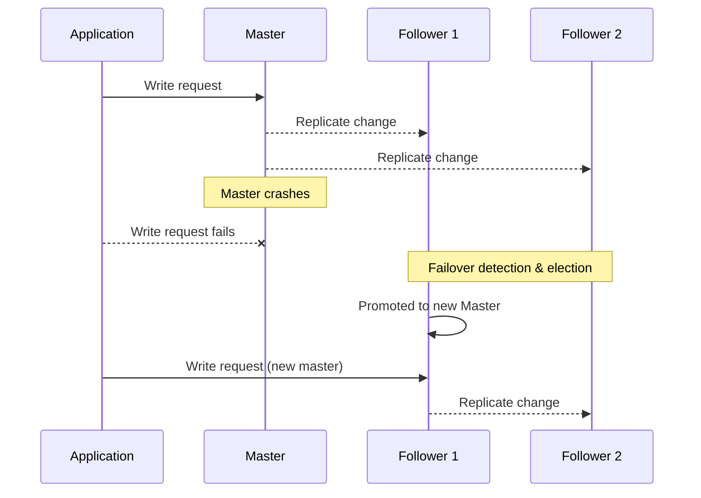

# Diagrams: Database Replication

## 1. Master-Slave (Leader-Follower) Replication

*Caption: All writes go to a single master, which streams changes to followers; reads can be distributed across the master and any follower to scale read capacity.*

## 2. Master-Master (Multi-Leader) Replication

*Caption: Multiple masters each accept writes locally and replicate to each other; concurrent writes to the same record must go through conflict resolution.*

## 3. Failover Sequence in Master-Slave Replication

*Caption: When the master fails, a follower must be detected as missing, elected, and promoted before writes can resume — this gap is the failover window.*
