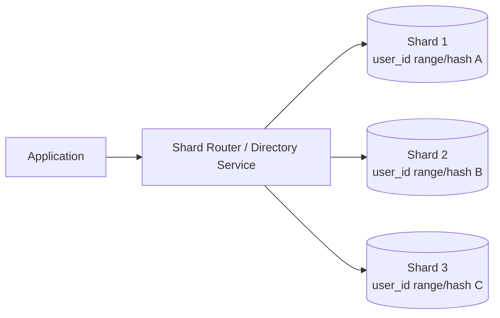
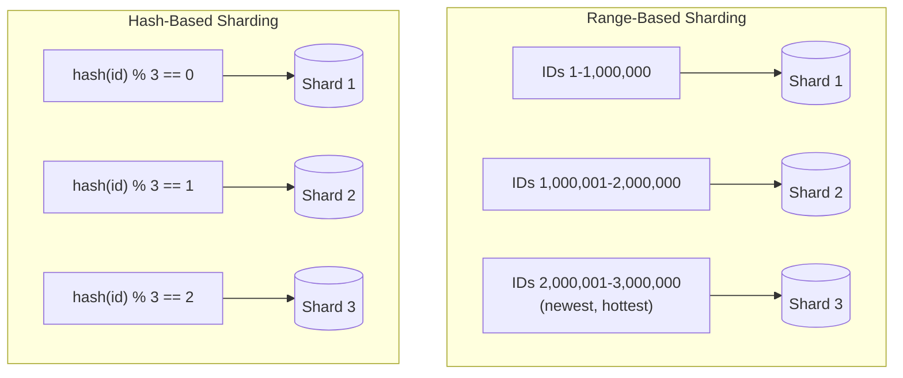
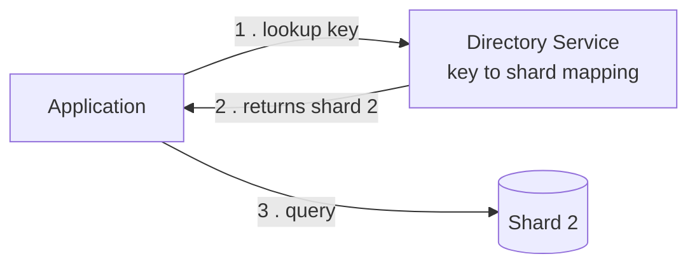

# Diagrams: Database Sharding & Partitioning

## 1. Sharded Database Layout (Application → Router → Shards)

*The application never talks to shards directly — a router (or lookup/directory service) inspects the shard key on each request and forwards it to the one shard that owns that data.*

## 2. Range-Based vs Hash-Based Key Distribution

*Range-based sharding keeps contiguous keys together (great for range scans, but new/sequential traffic piles onto one shard); hash-based sharding scatters keys pseudo-randomly (even load, but no cheap range scans).*

## 3. Directory-Based Sharding Lookup

*Directory-based sharding adds one extra network hop to resolve "which shard owns this key," but in exchange lets individual keys be moved or rebalanced freely without a rigid formula.*
