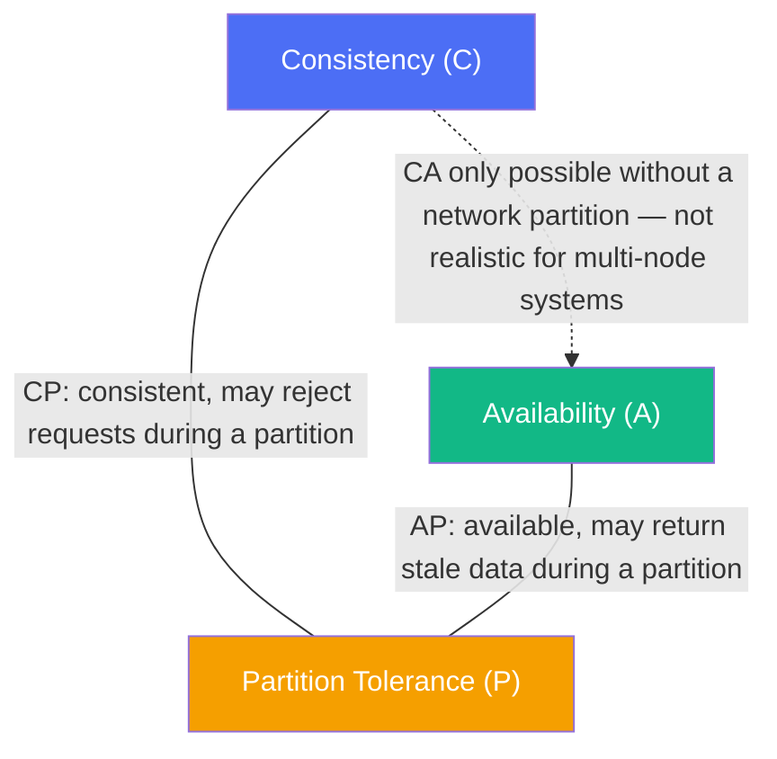
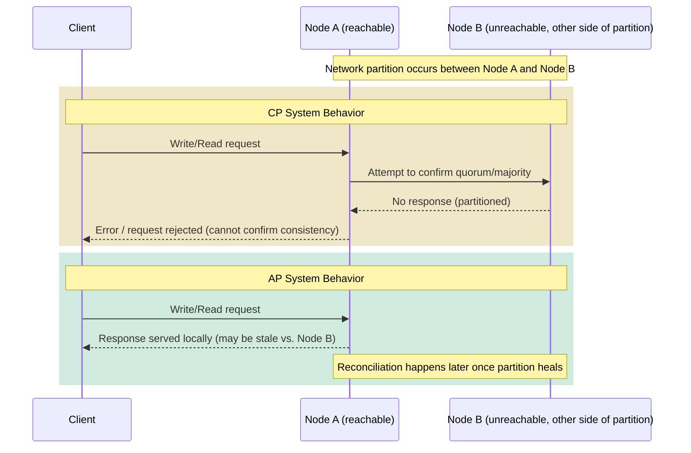
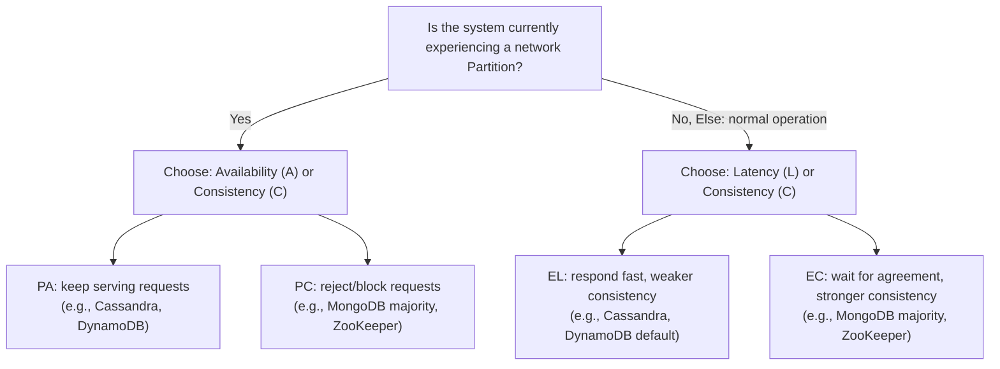

# Diagrams: CAP Theorem & PACELC

Mermaid has no native triangle/Venn shape, so the CAP relationship below is approximated as a graph of the three properties with the "pick two" pairings called out.

## 1. CAP Theorem — Pick Two of Three

*Caption: A distributed system can only fully guarantee two of Consistency, Availability, and Partition Tolerance at once — since partitions are unavoidable, real systems must choose CP or AP.*

## 2. Read/Write During a Network Partition — CP vs. AP

*Caption: In a CP system, Node A refuses the request when it can't confirm agreement with the partitioned Node B; in an AP system, Node A answers immediately and reconciles any divergence after the partition heals.*

## 3. PACELC Decision Flow

*Caption: PACELC adds a second decision that applies even without a partition — trading Latency against Consistency during normal operation.*
