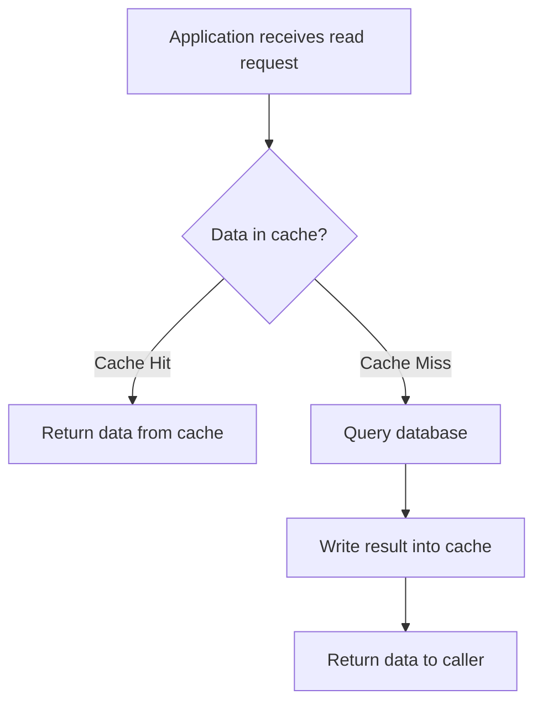
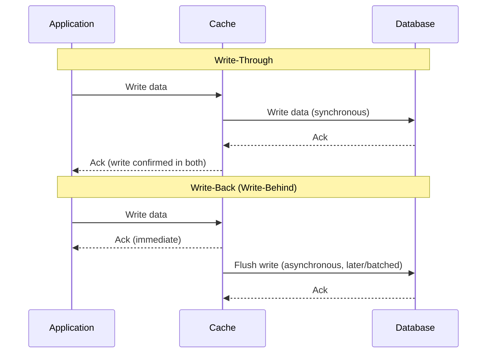
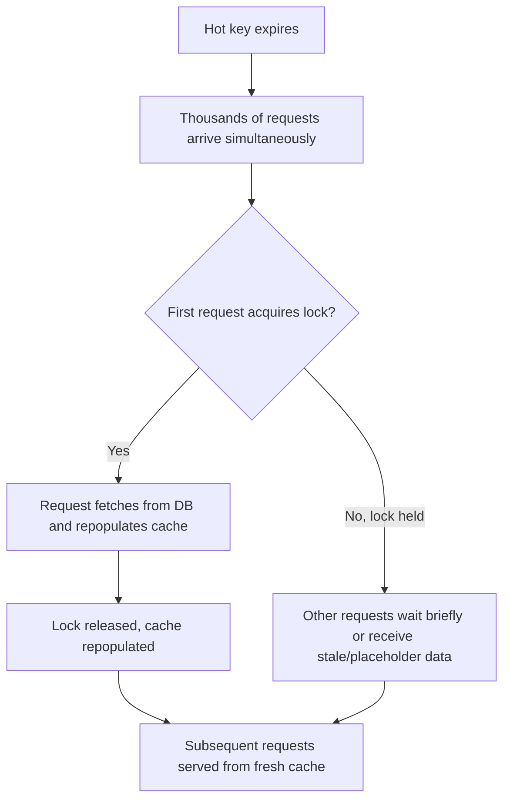

# Diagrams: Caching Strategies & Cache Invalidation

## 1. Cache-Aside Read Flow

*Caption: In cache-aside, the application checks the cache first and only falls back to the database on a miss, populating the cache afterward.*

## 2. Write-Through vs Write-Back Sequence

*Caption: Write-through confirms only after both cache and DB are updated; write-back confirms immediately and flushes to the database asynchronously.*

## 3. Cache Stampede Mitigation with Request Coalescing

*Caption: Request coalescing ensures only one request repopulates a hot cache key while others wait or receive a stale fallback, protecting the database from a stampede.*
