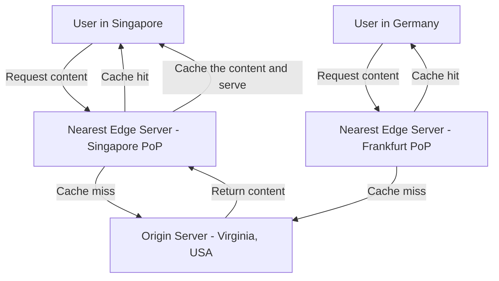
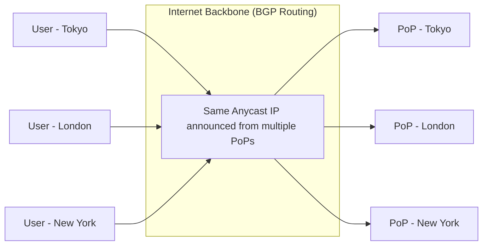
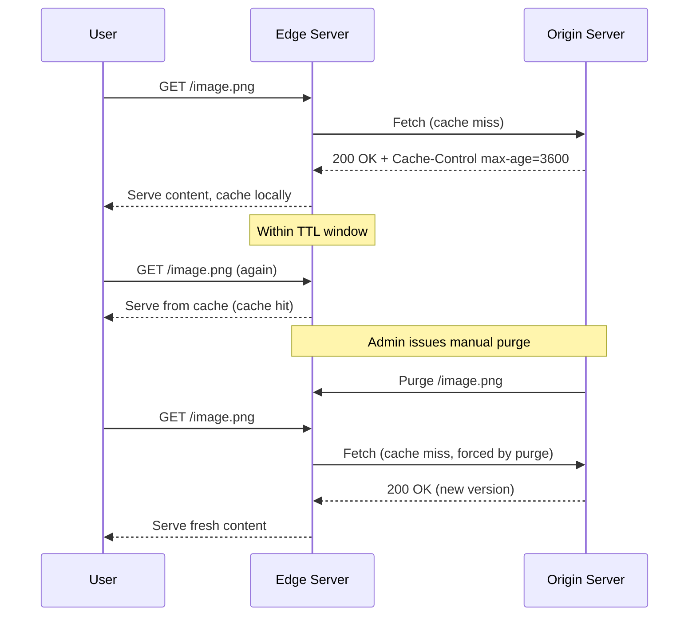

# Diagrams: CDN (Content Delivery Network) Explained

## 1. CDN Request Routing: Edge vs Origin

*Caption: Requests are routed to the geographically nearest edge server; only cache misses travel all the way back to the distant origin.*

## 2. Anycast Routing to the Nearest PoP

*Caption: With Anycast, all PoPs share the same IP address; BGP routing automatically directs each user's traffic to the topologically nearest PoP.*

## 3. CDN Cache Lifecycle: TTL Expiration and Purge

*Caption: Edge servers serve cached content until the TTL expires or an explicit purge forces revalidation against the origin.*
