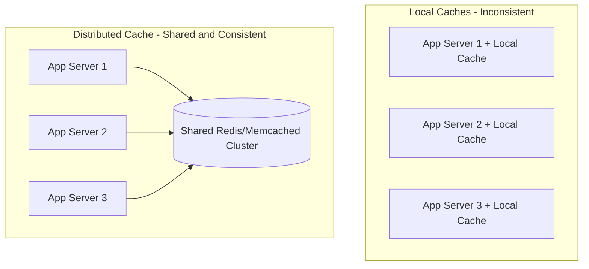
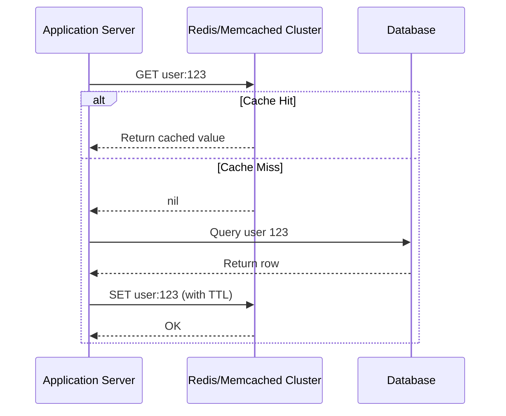
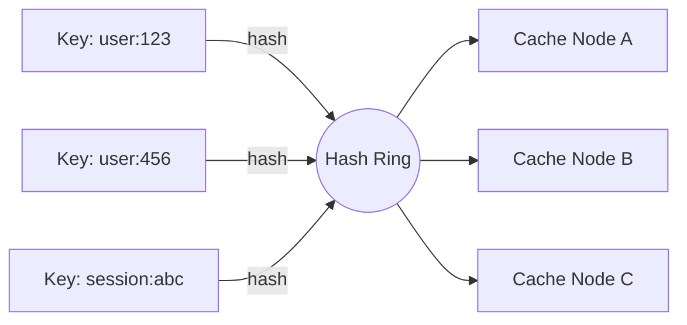

# Diagrams: Distributed Caching with Redis & Memcached

## 1. Local Cache vs Distributed Cache Architecture

*Caption: Local caches create separate, inconsistent copies per server; a distributed cache gives every server the same shared view of cached data.*

## 2. Distributed Cache Read/Write Flow (Cache-Aside with a Redis Cluster)

*Caption: Application servers treat the distributed cache cluster as a single shared endpoint, applying cache-aside logic on top of it.*

## 3. Sharding Keys Across a Cache Cluster (Consistent Hashing)

*Caption: Keys are hashed onto a ring and mapped to the nearest cache node, so adding or removing a node only remaps a small fraction of keys.*
