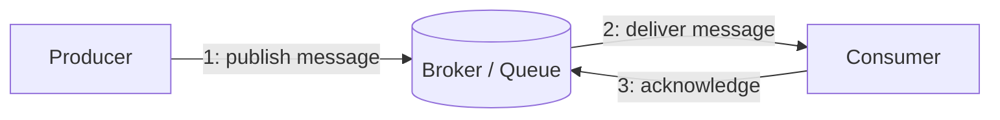
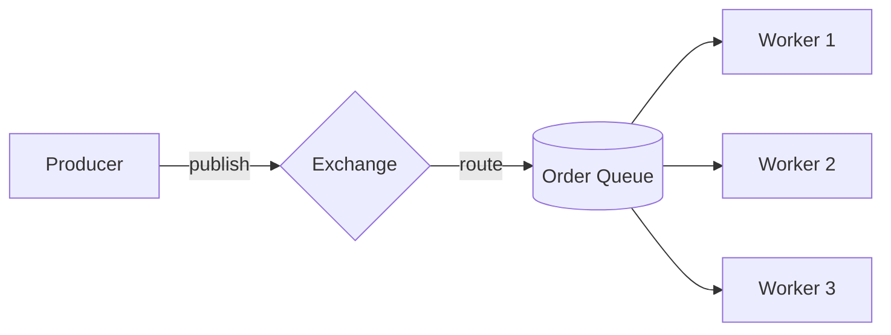
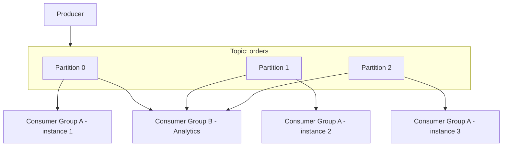

# Diagrams: Message Queues, Kafka vs RabbitMQ

## 1. Basic Producer-Consumer Flow via a Message Queue

*A producer publishes a message to the broker and moves on; the consumer processes it independently and acknowledges completion.*

## 2. RabbitMQ-Style Routing with a Consumer Group

*RabbitMQ routes messages through an exchange into a queue; multiple workers compete for messages, each message handled by exactly one worker.*

## 3. Kafka Topic, Partitions, and Independent Consumer Groups

*Kafka partitions a topic for parallel consumption within a group, while entirely separate consumer groups can independently replay the same data.*
