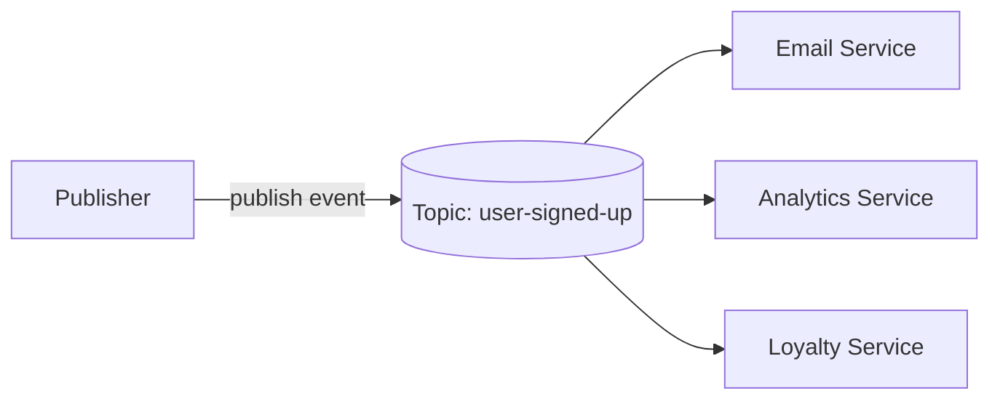
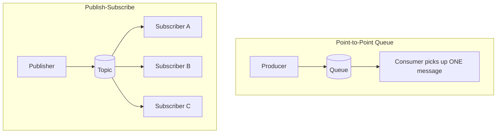
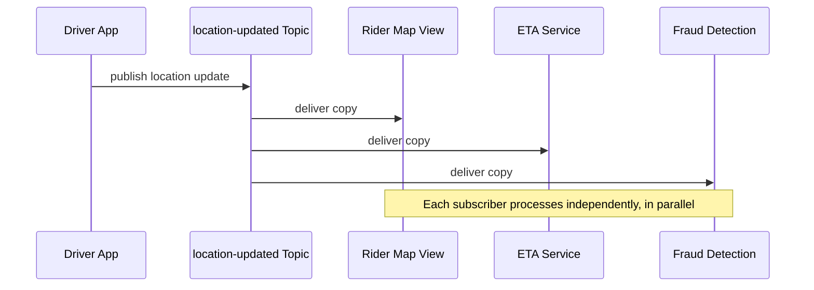

# Diagrams: Publish-Subscribe Pattern

## 1. Basic Pub-Sub Fan-Out

*One published event fans out to three independent subscribers, none of whom the publisher is aware of.*

## 2. Point-to-Point Queue vs Pub-Sub Side by Side

*A queue delivers each message to a single consumer; a topic delivers each message to every subscriber.*

## 3. Sequence of a Ride-Sharing Location Update Event

*A single location update event is independently delivered to three unrelated downstream services.*
