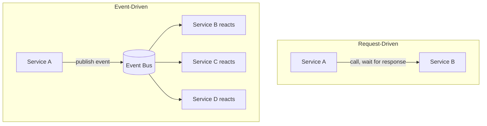
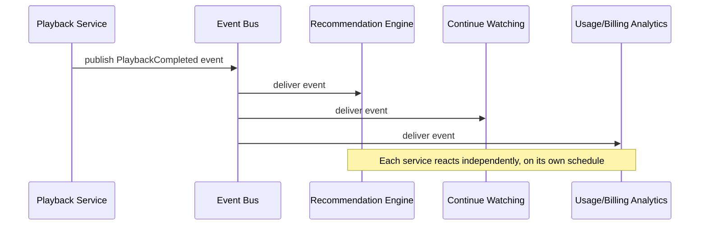
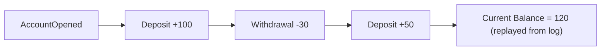

# Diagrams: Event-Driven Architecture

## 1. Request-Driven vs Event-Driven Control Flow

*Request-driven flow blocks on a direct call; event-driven flow lets any number of services react independently and asynchronously.*

## 2. Event-Driven Reaction Chain (Netflix-style Example)

*A single "playback completed" event triggers three independent, decoupled reactions.*

## 3. Event Sourcing: State Derived from an Event Log

*In event sourcing, the current state is computed by replaying the full history of events rather than being stored directly.*
