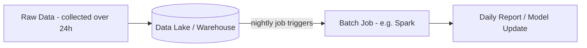
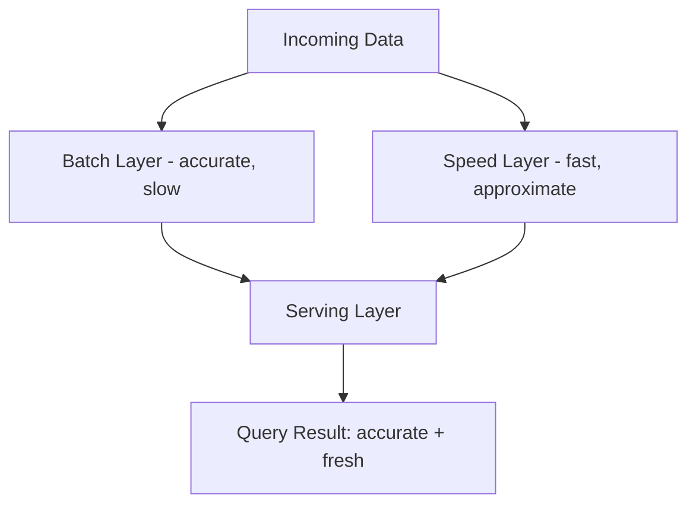

# Diagrams: Batch vs Stream Processing

## 1. Batch Processing Flow

*Data accumulates over a bounded window before a single batch job processes it all at once.*

## 2. Stream Processing Flow with Windowing

*Events are processed continuously as they arrive, aggregated into short time windows for near real-time results.*

## 3. Lambda Architecture: Batch and Speed Layers Merged

*Lambda architecture runs data through both a slow accurate batch layer and a fast approximate speed layer, merging both views at query time.*
