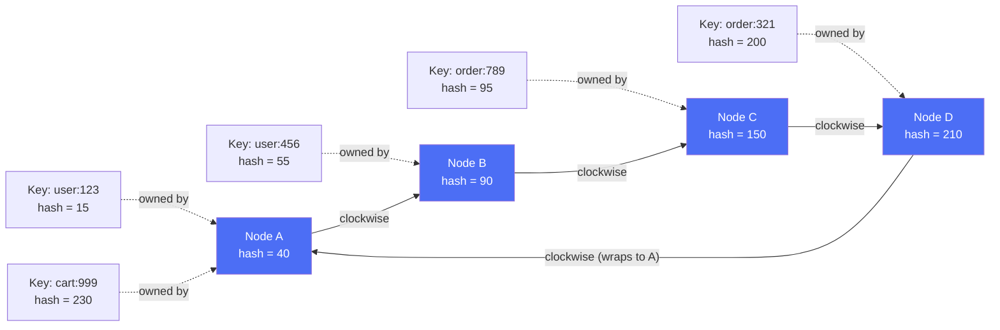
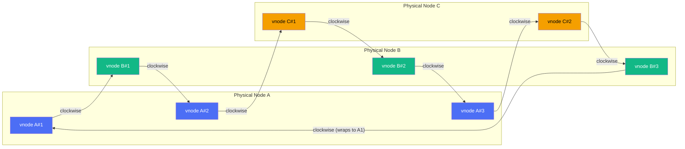
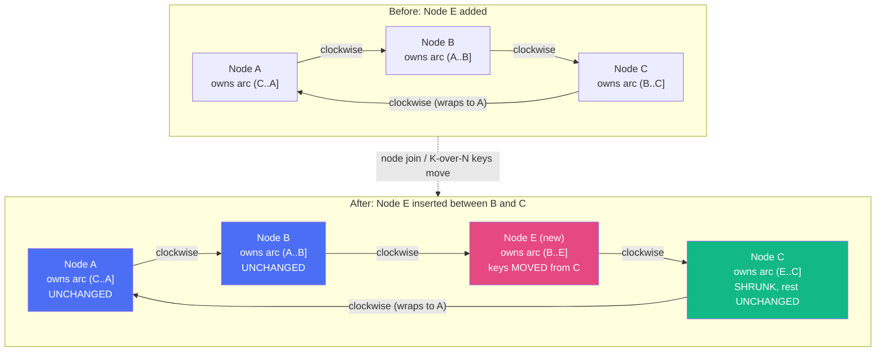

# Diagrams: Consistent Hashing

Mermaid does not support true circular/ring layouts, so the ring order is represented with a labeled graph. Node order in each diagram follows the comment "ring order (clockwise)" — read the graph in that sequence to picture the ring wrapping back to the first node.

## 1. The Hash Ring: Nodes and Keys

Caption: Keys are placed on the ring by hash value and owned by the first node found going clockwise.

## 2. Virtual Nodes Mapping

Caption: Each physical node is hashed multiple times, scattering its virtual points around the ring for even load distribution.

## 3. Node Addition / Removal: Key Remapping

Caption: Adding Node E only remaps the arc it inherits from Node C; every other node's keys stay put.

