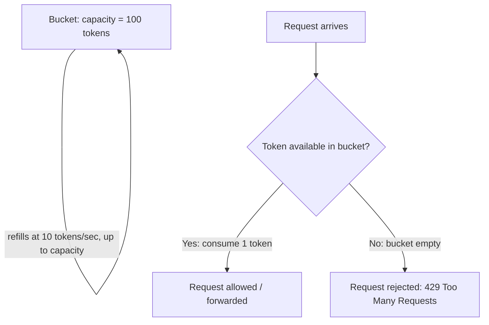
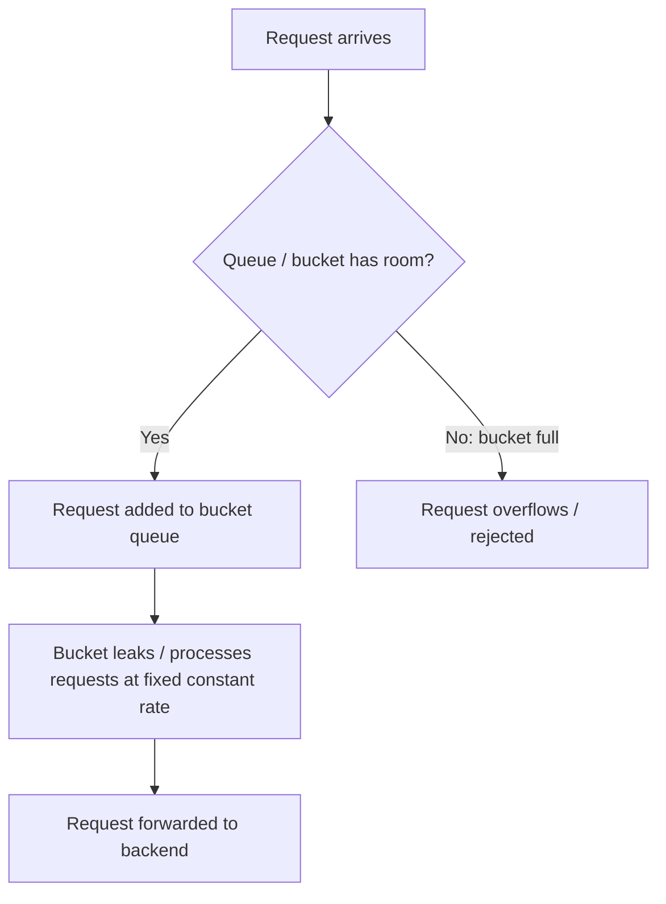
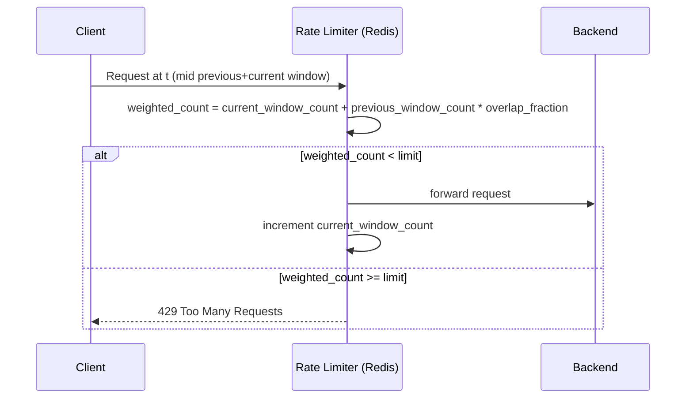

# Diagrams: Rate Limiting Algorithms

## Token Bucket Flow

*Caption: Tokens refill continuously up to the bucket's capacity; each request consumes one token, so idle time lets bursts through instantly until tokens run out.*

## Leaky Bucket Flow

*Caption: Requests queue up in the bucket and are drained to the backend at a strictly constant rate, regardless of how bursty the incoming traffic was.*

## Sliding Window Counter Concept

*Caption: The sliding window counter blends the previous and current fixed-window counts, weighted by how much of the previous window still overlaps the sliding view, approximating a true sliding log cheaply.*
