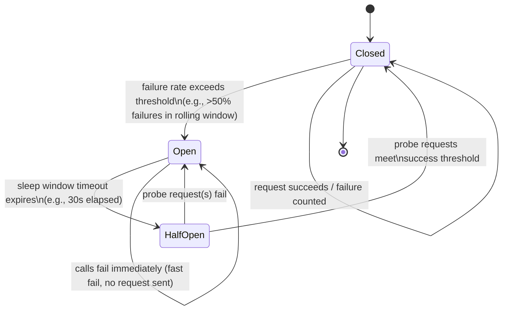
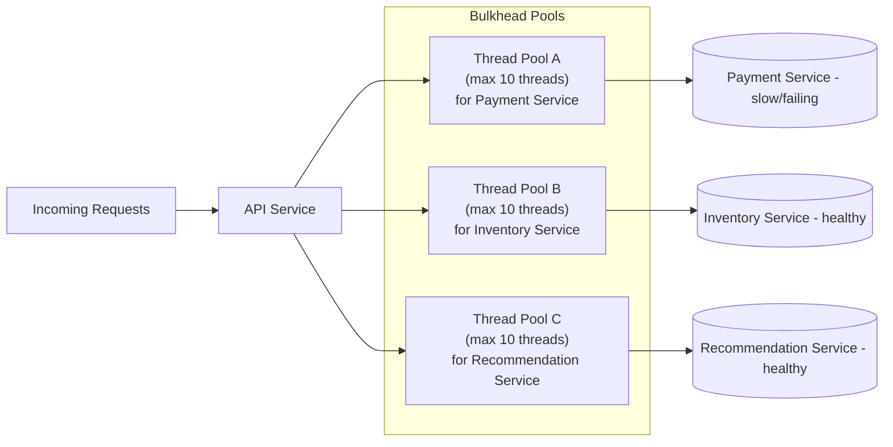

# Diagrams — Circuit Breaker, Retry & Bulkhead Patterns

## 1. Circuit Breaker State Machine



Caption: The circuit breaker starts Closed, trips to Open on sustained failures, and cautiously probes recovery via Half-Open before fully resetting.

## 2. Retry with Exponential Backoff and Jitter

```mermaid
sequenceDiagram
    participant Client
    participant Service as Downstream Service

    Client->>Service: Attempt 1
    Service-->>Client: Failure (timeout)
    Note over Client: Wait ~100ms (base delay + jitter)

    Client->>Service: Attempt 2
    Service-->>Client: Failure (timeout)
    Note over Client: Wait ~200ms (2x base + jitter)

    Client->>Service: Attempt 3
    Service-->>Client: Failure (timeout)
    Note over Client: Wait ~400ms (4x base + jitter)

    Client->>Service: Attempt 4
    Service-->>Client: Success (200 OK)
    Note over Client: Retry budget respected; stop retrying
```

Caption: Each retry delay roughly doubles and includes random jitter, spreading out retries so many clients don't hammer the service in synchronized waves.

## 3. Bulkhead Isolation Across Dependencies



Caption: Each downstream dependency gets its own bounded thread pool, so a slow or failing Payment Service exhausts only its own pool and never starves calls to Inventory or Recommendations.
