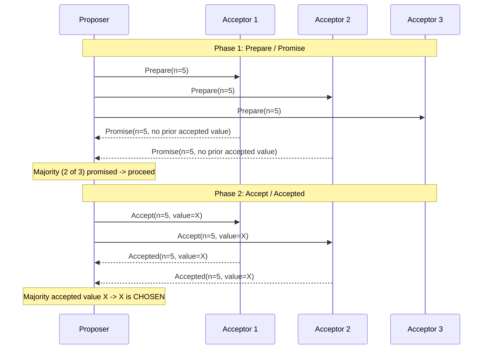
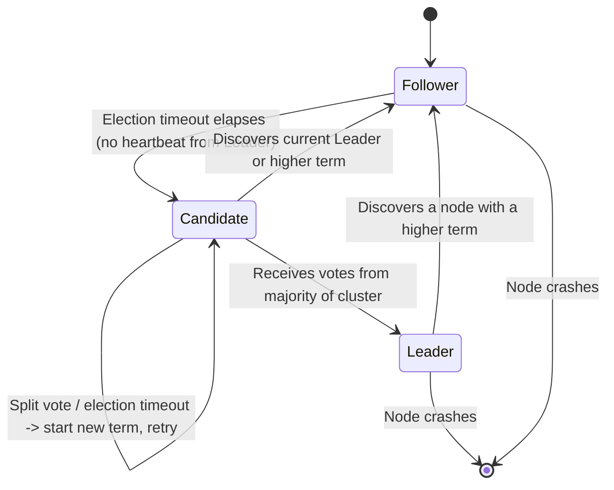
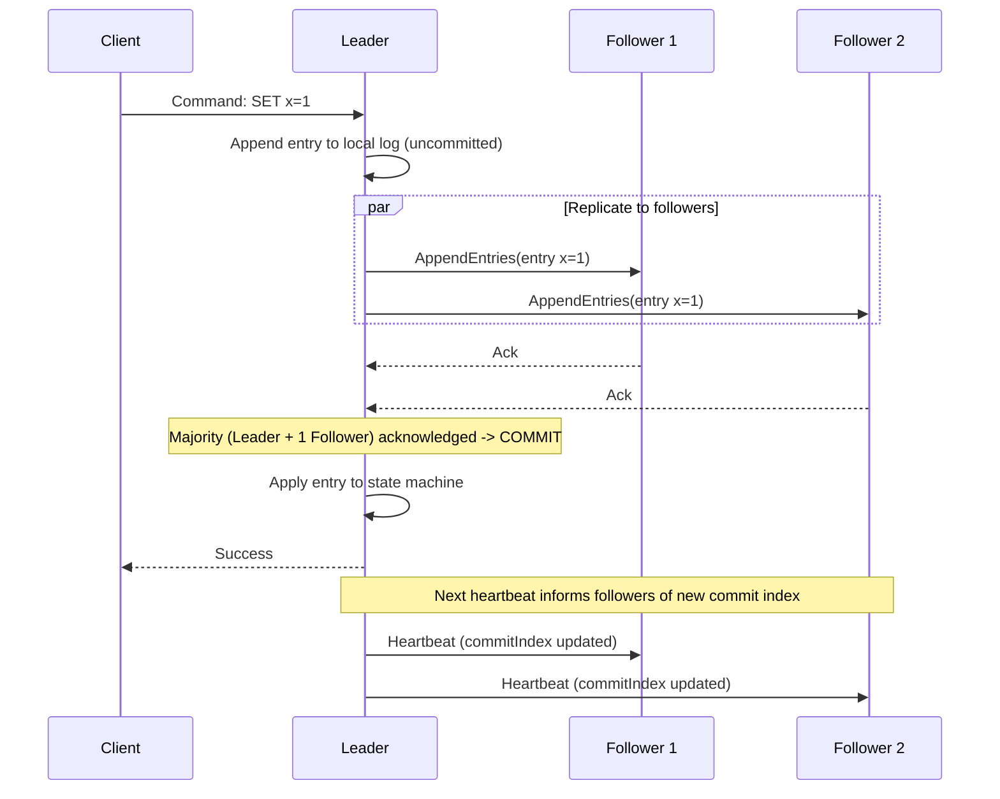

# Diagrams: Consensus Algorithms (Paxos & Raft)

## 1. Paxos — Prepare/Promise and Accept/Accepted Phases

Caption: A value is chosen once a majority of Acceptors accept the same proposal number and value — the Proposer never needs all N Acceptors, only a quorum.

## 2. Raft — Node State Transitions

Caption: Every Raft node is a Follower, Candidate, or Leader; a randomized election timeout drives Follower to Candidate, and only a majority vote promotes a Candidate to Leader for that term.

## 3. Raft — Log Replication

Caption: The Leader commits a log entry as soon as a majority of the cluster (including itself) has durably appended it, then informs Followers of the new commit index on the next heartbeat.
