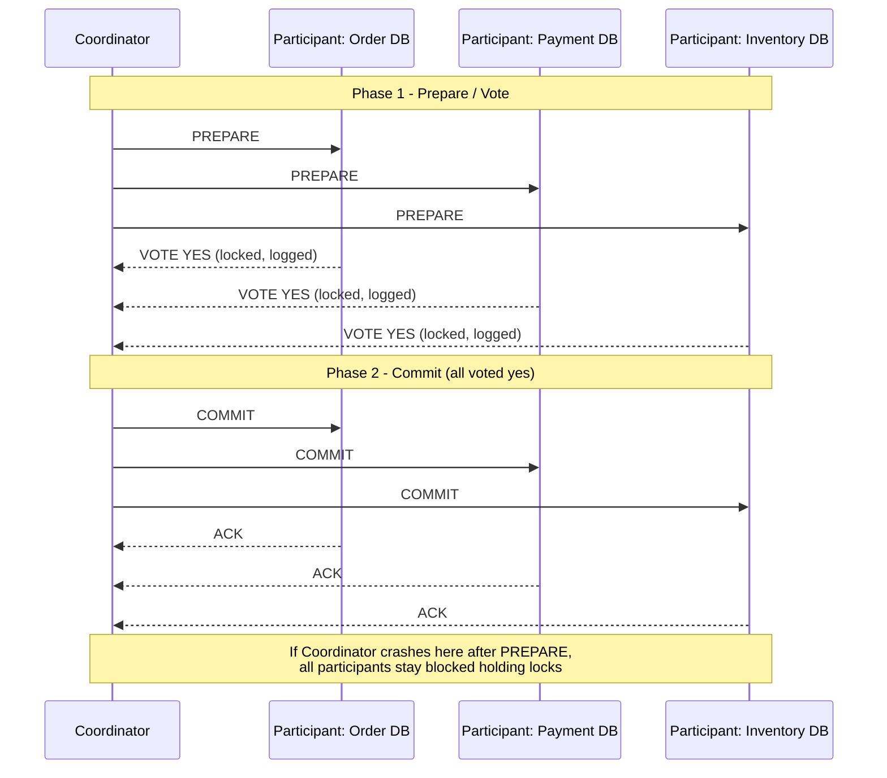
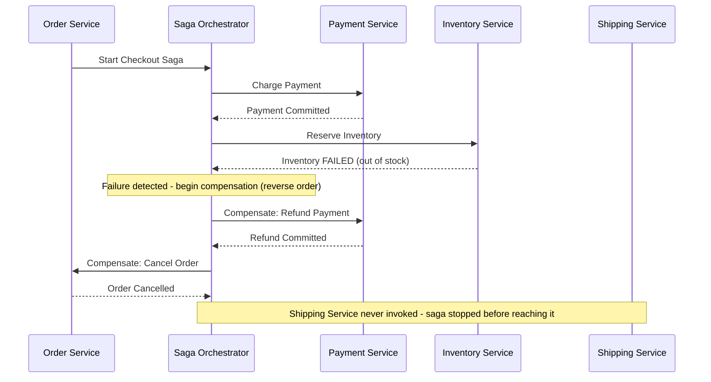
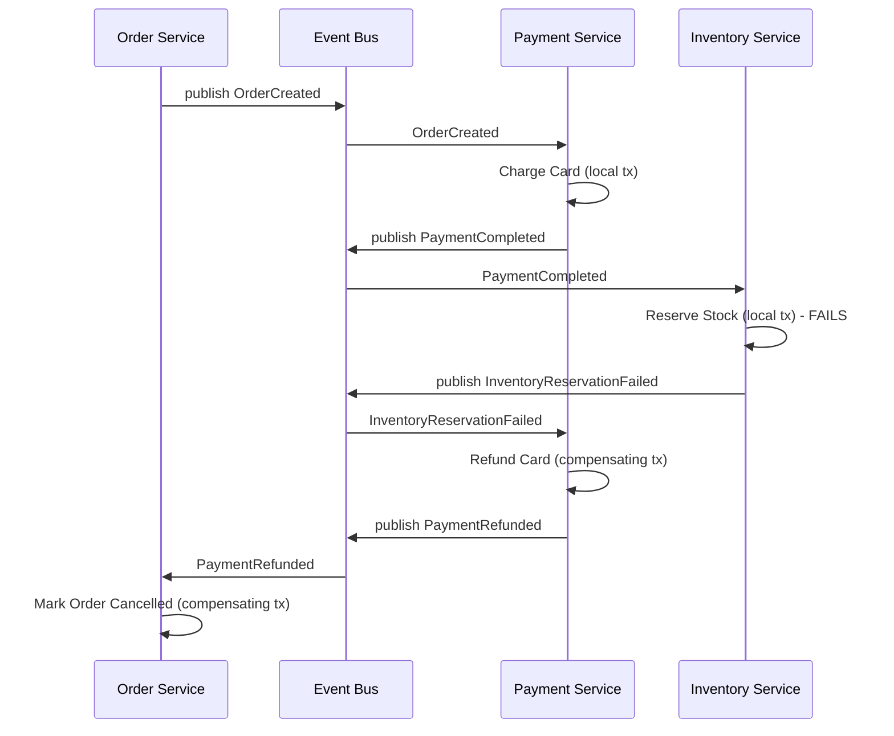

# Diagrams: Distributed Transactions — 2PC & Saga

## 1. Two-Phase Commit (2PC)

*Caption: 2PC requires a unanimous "yes" vote from every participant before the coordinator commits; a coordinator crash between Prepare and Commit leaves participants blocked.*

## 2. Orchestration-Based Saga (with Compensation on Failure)

*Caption: A central orchestrator drives each local transaction in sequence and explicitly triggers compensating transactions, in reverse order, when a downstream step fails.*

## 3. Choreography-Based Saga (Event-Driven, No Central Orchestrator)

*Caption: In choreography, each service reacts to events independently and runs its own compensating transaction on failure — there is no central coordinator tracking the overall saga state.*
