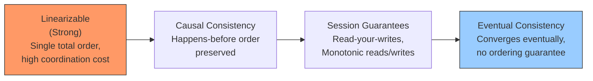
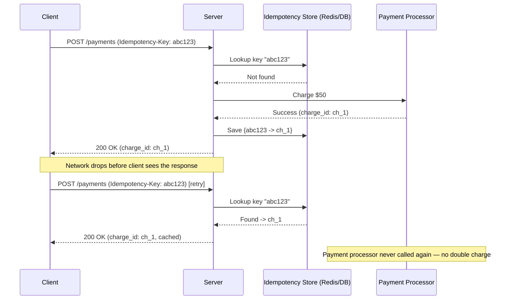
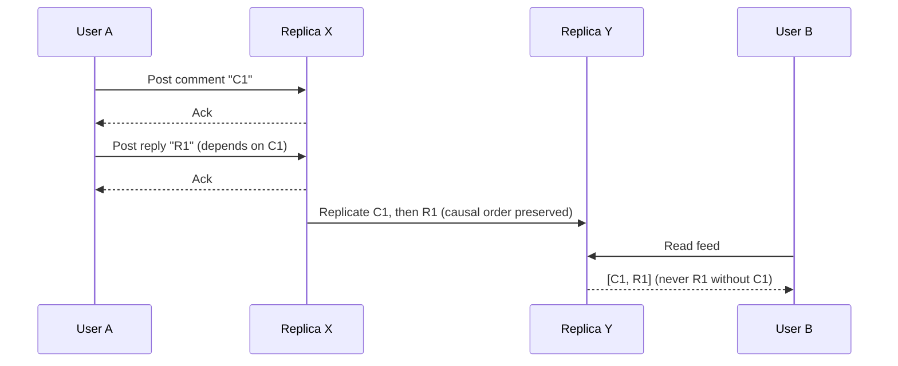

# Diagrams: Data Consistency Models & Idempotency

The consistency spectrum, from strongest to weakest guarantee.

*Caption: Consistency models form a spectrum — the strongest guarantees (left) cost the most in coordination and availability; the weakest (right) maximize availability and latency.*

A client retrying a payment request with an idempotency key avoids a double charge.

*Caption: The server deduplicates retries by idempotency key, returning the original result instead of reprocessing the payment.*

Causal consistency: a reply must never be visible before the comment it responds to.

*Caption: Causal consistency guarantees that a "happens-before" relationship (reply depends on comment) is preserved across all replicas, even though unrelated events may still arrive out of order.*
