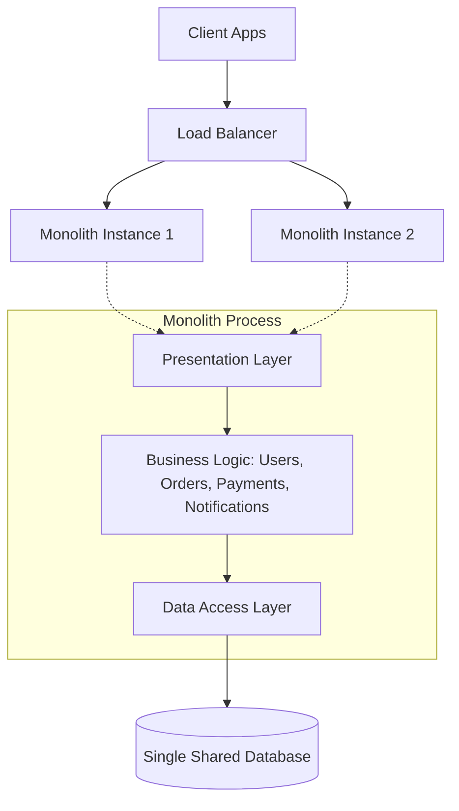
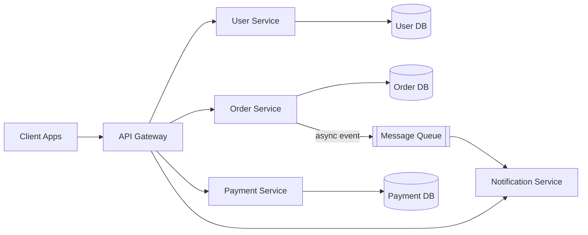
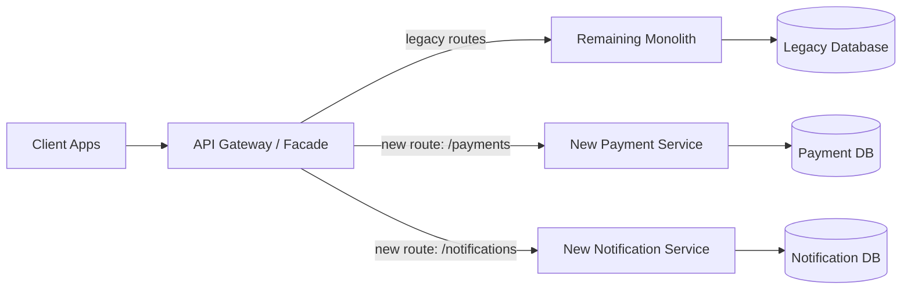

# Diagrams: Monolith vs Microservices

## 1. Monolithic Architecture

*A monolith deploys all modules as one unit, replicated behind a load balancer, sharing one database.*

## 2. Microservices Architecture

*Each microservice is independently deployable, owns its own database, and communicates over the network directly or via a message queue.*

## 3. Strangler Fig Migration Path

*The strangler fig pattern routes traffic for newly-extracted capabilities to new services while the shrinking monolith still serves everything else.*
