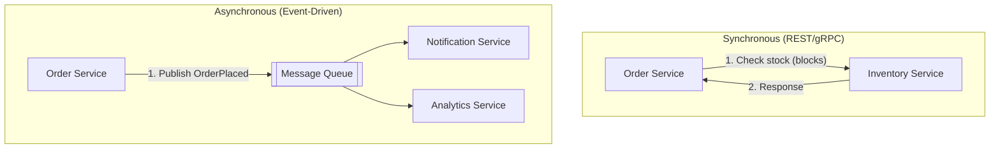
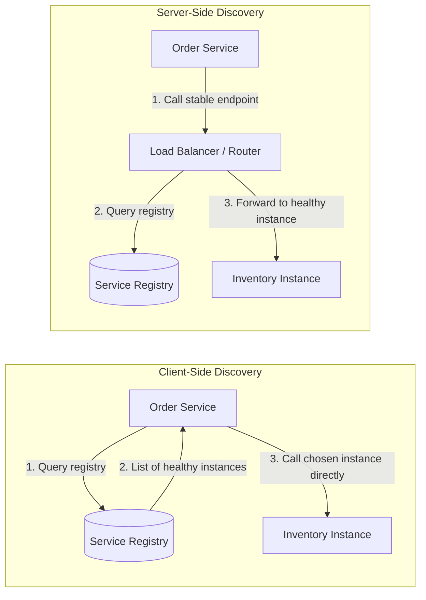
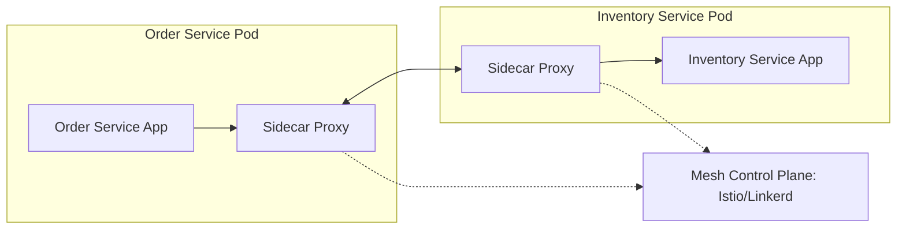

# Diagrams: Microservices Communication & Service Discovery

## 1. Synchronous vs Asynchronous Communication

*Synchronous calls block for an immediate answer; asynchronous events decouple the publisher from consumers in time.*

## 2. Client-Side vs Server-Side Service Discovery

*Client-side discovery puts lookup and load balancing in the caller; server-side discovery hides it behind a load balancer.*

## 3. Service Mesh with Sidecar Proxies

*In a service mesh, sidecar proxies handle discovery, load balancing, retries, and security, while a control plane configures them all.*
