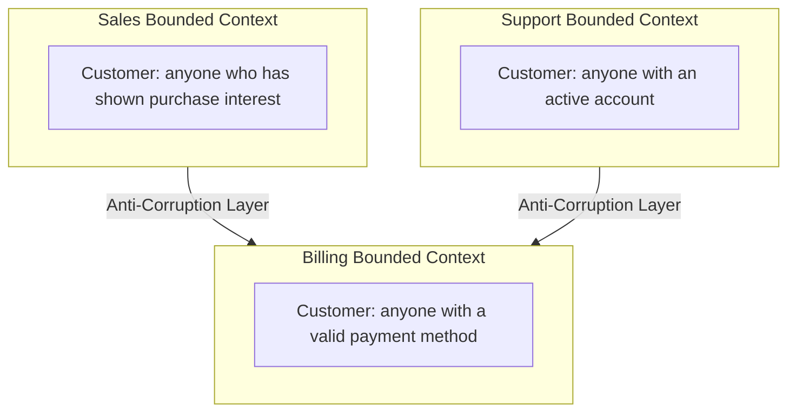
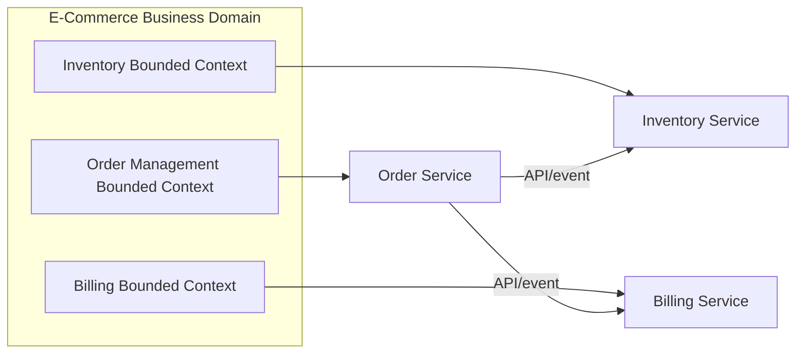
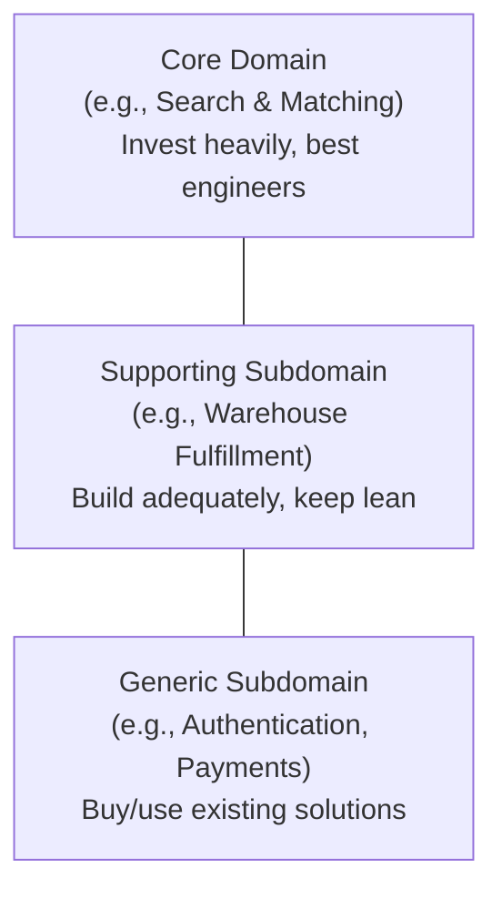

# Diagrams: Domain-Driven Design Basics

## 1. Bounded Contexts with Different Meanings of "Customer"

*Each bounded context has its own model of "Customer"; anti-corruption layers translate between them instead of sharing one model.*

## 2. Mapping Bounded Contexts to Microservices

*Each bounded context maps naturally to its own microservice, communicating over well-defined APIs/events rather than a shared database.*

## 3. Core, Supporting, and Generic Subdomains

*Classifying subdomains helps decide where to invest deep custom engineering versus where to buy an existing solution.*
