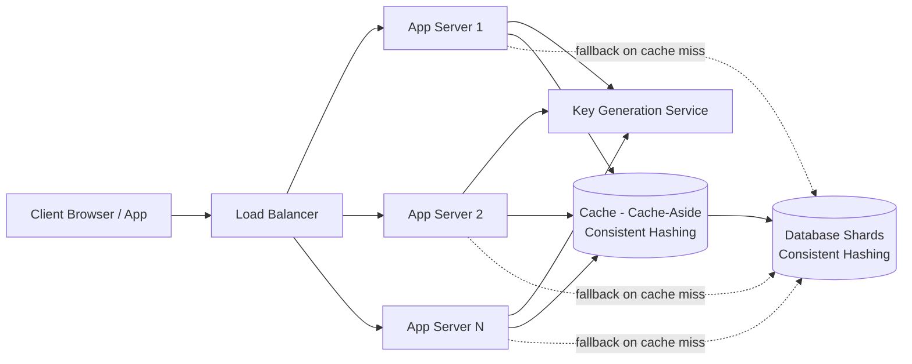
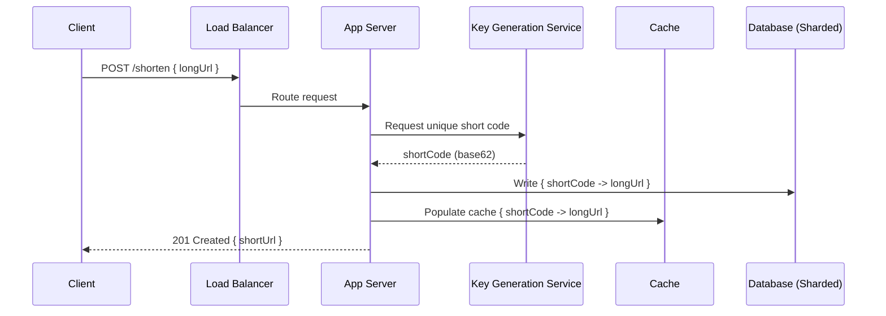
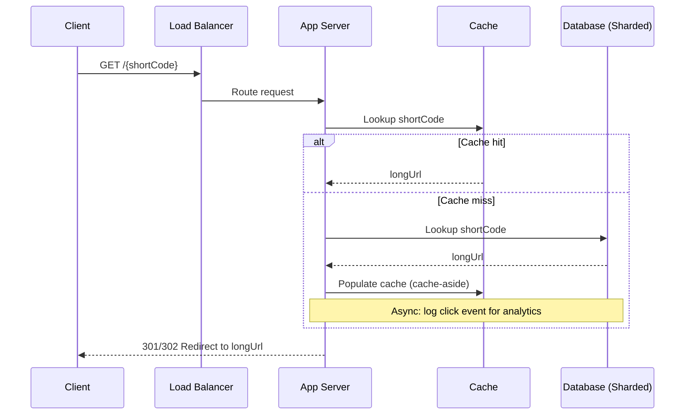

# Diagrams: URL Shortener

## 1. High-Level Architecture

*Caption: Client requests hit a load balancer, fan out across stateless app servers, which consult a key generation service on writes and a cache-aside layer in front of sharded databases on reads.*

## 2. Write Path (Shorten a URL)

*Caption: On write, the app server obtains a collision-free short code from the key generation service, persists the mapping to the sharded database, and warms the cache before responding.*

## 3. Read Path (Redirect)

*Caption: The read path checks the cache-aside layer first for near-instant redirects, falling back to the sharded database only on a cache miss, with click logging kept off the critical path.*
