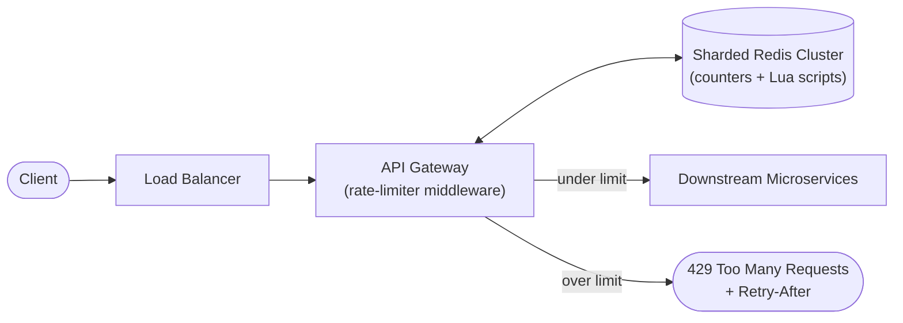
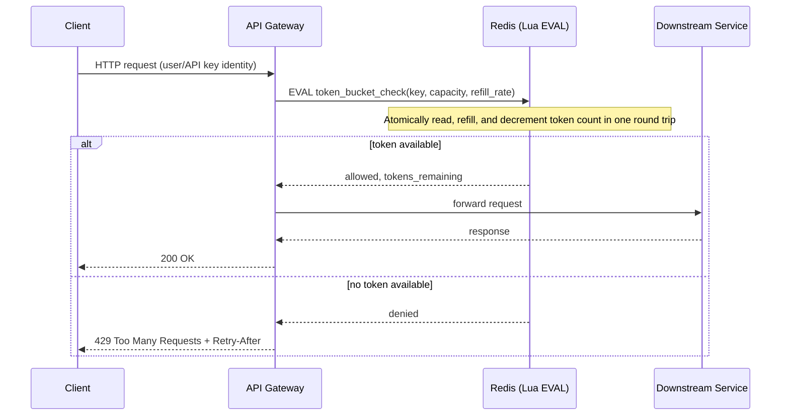
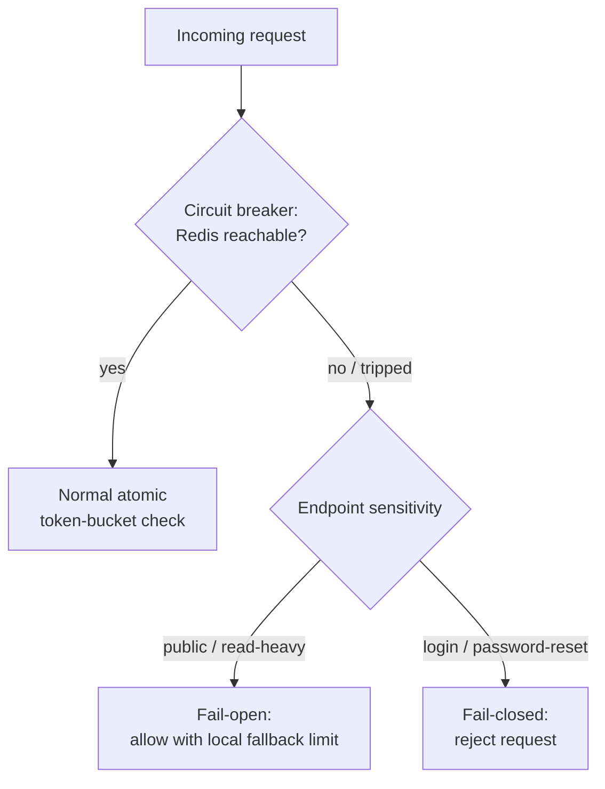

# Diagrams — Design a Rate Limiter

Companion diagrams for [`README.md`](./README.md). Terminology matches `notes.md`.

## 1. High-Level Architecture

*Caption: Requests are checked against a centralized, sharded Redis store at the API gateway; rejected requests short-circuit at the edge and never reach downstream services.*

## 2. Request-Check Sequence (Token Bucket via Redis Lua Script)

*Caption: The check-and-decrement happens as a single atomic Lua script on Redis, eliminating the check-then-increment race condition across many concurrent gateway instances.*

## 3. Failure Mode — Fail-Open vs Fail-Closed When Redis Is Unavailable

*Caption: When the rate-limiter store itself is down, a circuit breaker routes to an explicit fail-open or fail-closed policy chosen per endpoint's sensitivity.*
