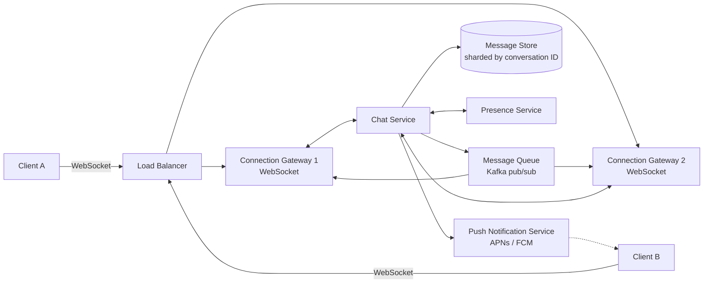
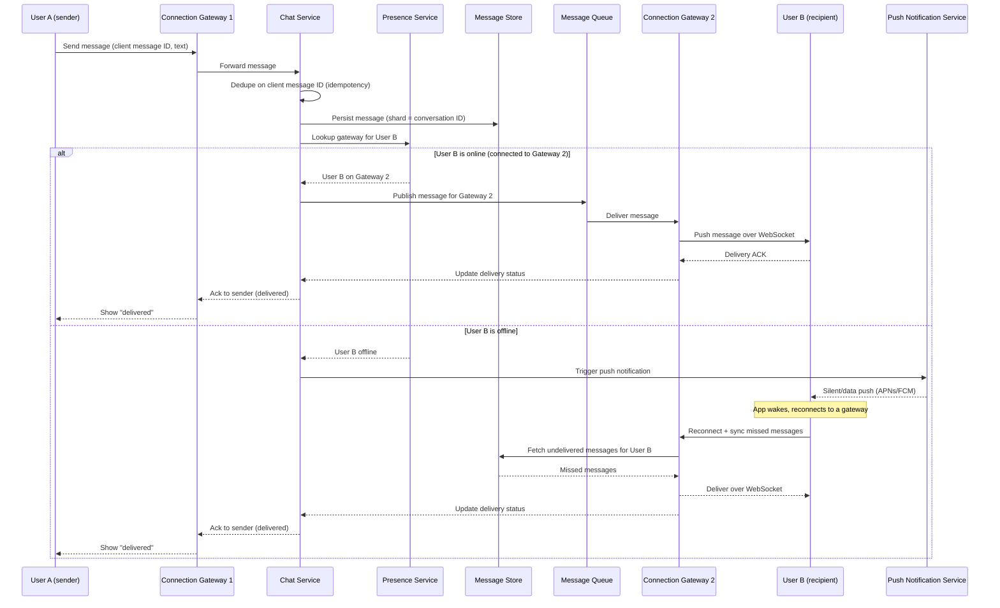

# Diagrams — Design a Chat Application (like WhatsApp)

## 1. Overall Architecture

*Clients hold persistent WebSocket connections pinned to a specific Connection Gateway; the Chat Service persists messages to sharded storage and uses the Message Queue plus Presence Service to route each message to the recipient's gateway, or to the Push Notification Service if the recipient is offline.*

## 2. Message Delivery Between Two Users on Different Connection Servers

*A message from User A on Gateway 1 is persisted and routed via the Message Queue to User B's Gateway 2 if online, or triggers a push notification and a reconnect-and-sync pull from the Message Store if User B is offline.*
