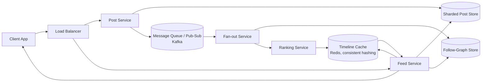
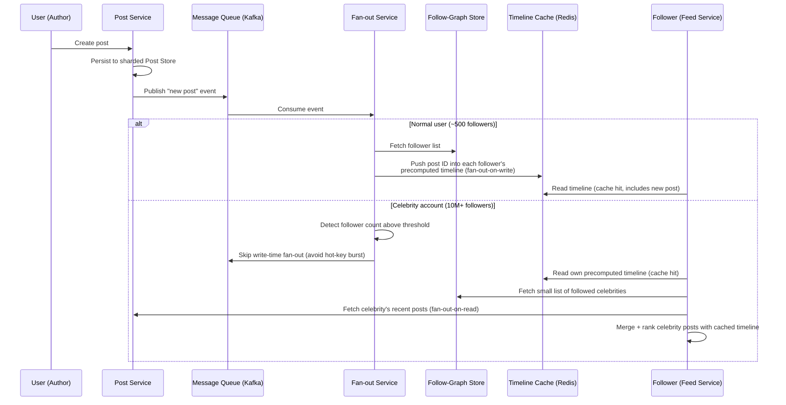

# Diagrams: Design a News Feed System (Twitter/Facebook)

## 1. Overall Architecture

*Caption: Writes flow from the Post Service through a sharded post store and a Kafka-based pub-sub layer into the Fan-out and Ranking services, which populate a consistently-hashed Redis timeline cache; reads are served by the Feed Service primarily from that cache.*

## 2. Hybrid Fan-out Sequence: Celebrity Post vs. Normal Post

*Caption: Normal-user posts are pushed to followers' caches at write time, while celebrity posts skip the expensive push and are merged into each follower's feed at read time instead, avoiding a hot-key write burst.*
