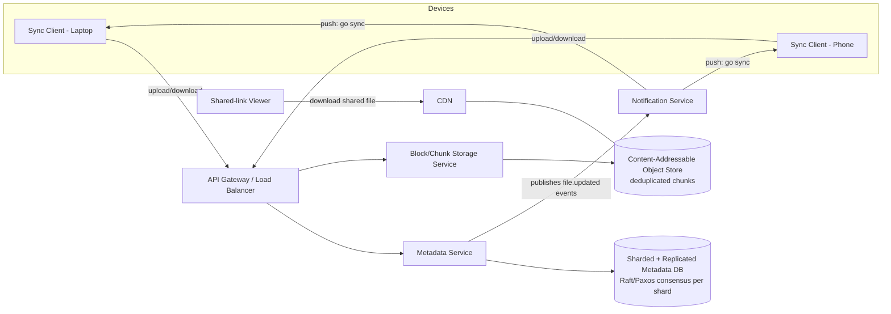
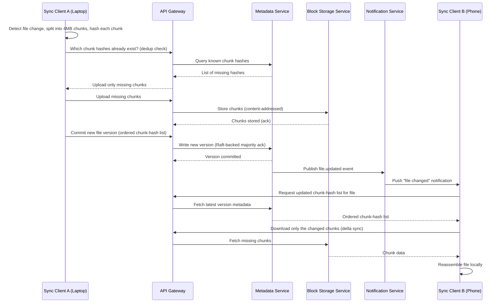

# Diagrams: Distributed File Storage System (Google Drive/Dropbox)

## 1. Overall Architecture

*Caption: The metadata service (strongly consistent, sharded/replicated) and block storage service (deduplicated, eventually consistent) are separate services; the notification service pushes change events so other devices sync without polling, and a CDN fronts hot shared-file downloads.*

## 2. Sequence: Uploading and Syncing a Changed File to Another Device

*Caption: Only missing/changed chunks are ever transferred -- both on initial upload (dedup) and on sync to the second device (delta sync) -- while the notification service makes the update visible on device B in near real time.*
