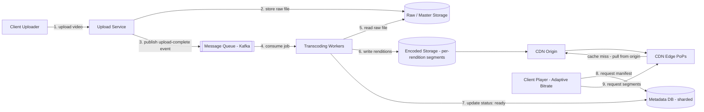
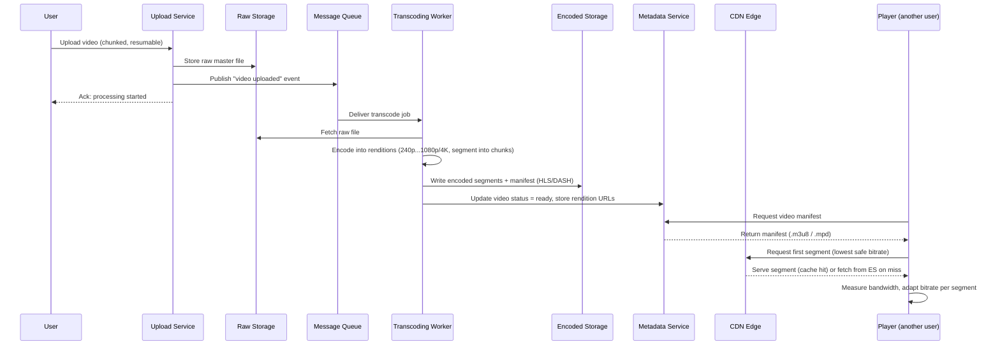

# Diagrams: Design a Video Streaming Platform (like YouTube/Netflix)

Companion diagrams for [README.md](README.md).

## 1. Overall Architecture

Upload, transcoding, storage, metadata, and CDN delivery to the client player.

*Caption: Uploads flow asynchronously through a queue into distributed transcoding workers, while playback reads are served almost entirely from CDN edge caches.*

## 2. Upload-to-Playback-Ready Sequence

The end-to-end pipeline from a user's upload to the video becoming streamable.

*Caption: The upload and transcoding path is asynchronous and decoupled by a queue, so playback readiness lags upload by the transcoding time, not the upload time.*
