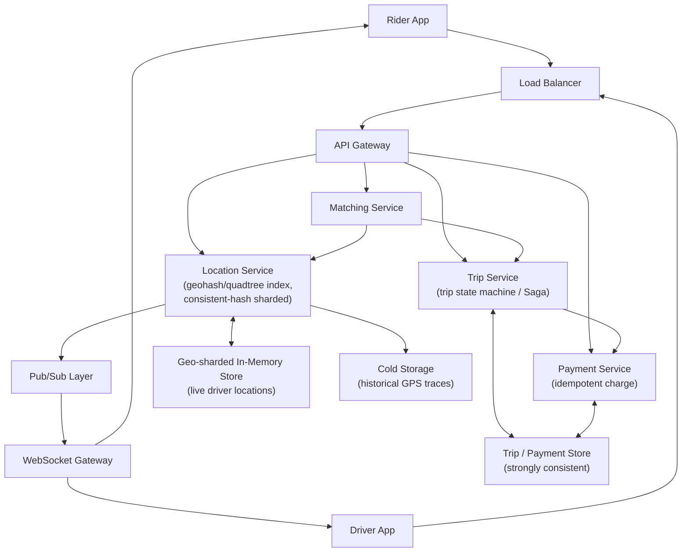
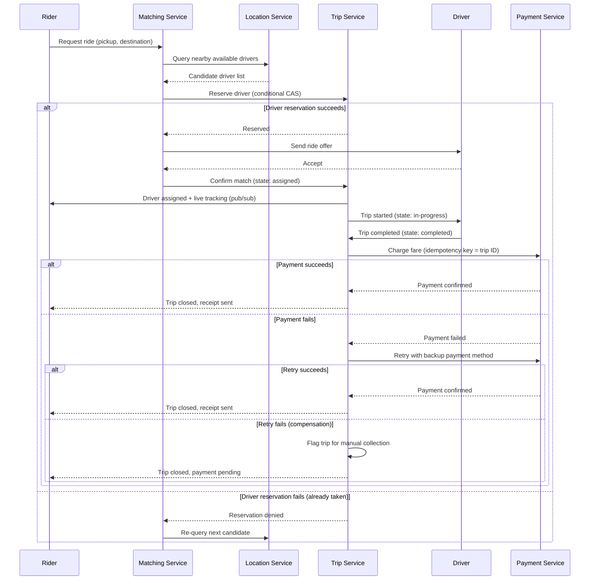

# Diagrams: Ride-Sharing System (Uber-like)

## 1. Overall Architecture

*Rider and driver apps reach the backend through a load balancer and API gateway; the Location Service (geohash + consistent hashing) feeds live positions to both a geo-sharded cache and a pub/sub layer that pushes real-time updates over WebSockets, while the Trip and Payment services keep trip/payment state in a strongly-consistent store.*

## 2. Ride Request → Match → Trip → Payment Saga (with Compensation)

*The trip is coordinated as a Saga of local transactions — reserve driver, confirm match, run trip, charge payment — with a compensating retry/flag-for-collection path if payment fails, and a re-match path if the initial driver reservation is denied.*
