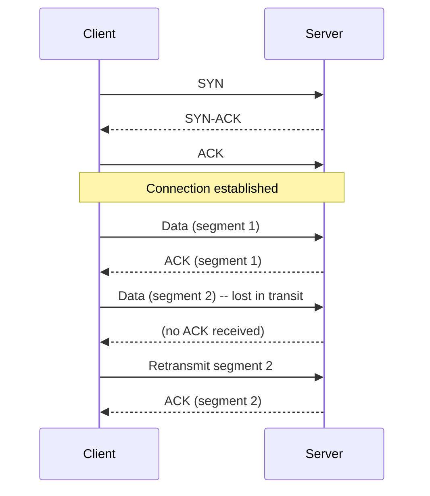
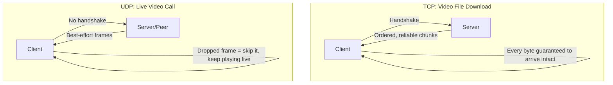
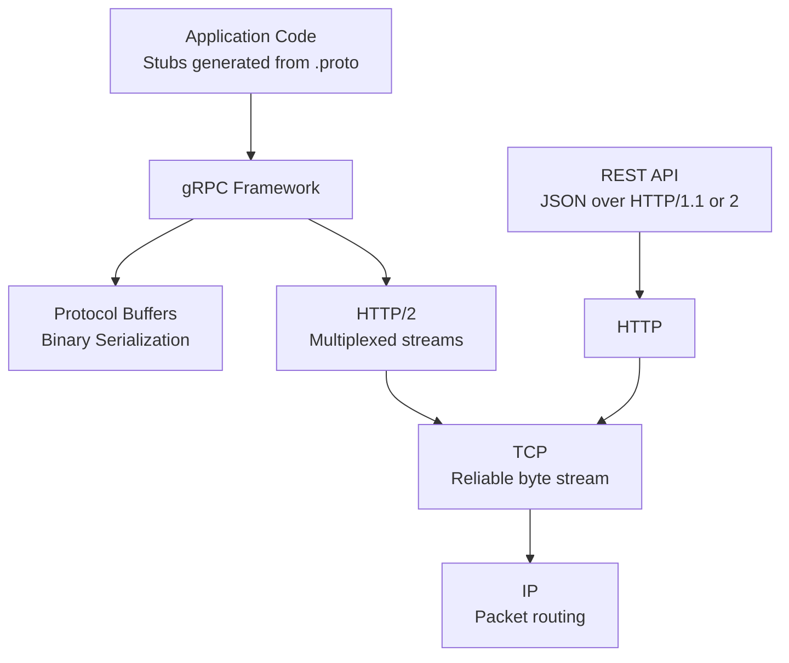

# Diagrams: Transport Protocols — TCP vs UDP & gRPC

## 1. TCP Three-Way Handshake, Then Data Transfer

*TCP requires a handshake before any data flows, and every segment is acknowledged — a lost segment is automatically retransmitted, guaranteeing reliable, ordered delivery.*

## 2. TCP vs UDP for the Same Task

*Downloading a file needs every byte intact, so TCP's retransmission is worth the cost. A live call needs freshness more than completeness, so UDP's "drop and move on" model wins.*

## 3. Where gRPC Sits in the Stack

*gRPC is a layer on top of HTTP/2 (itself on top of TCP), swapping JSON for Protocol Buffers and gaining HTTP/2's multiplexed streaming — while REST typically stays with JSON over plain HTTP.*
