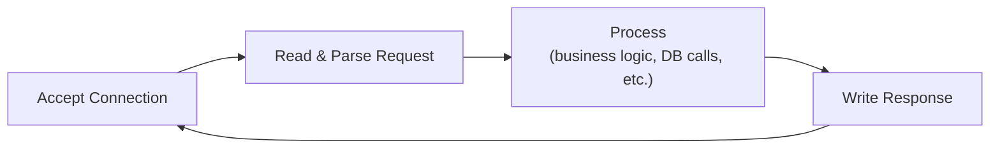
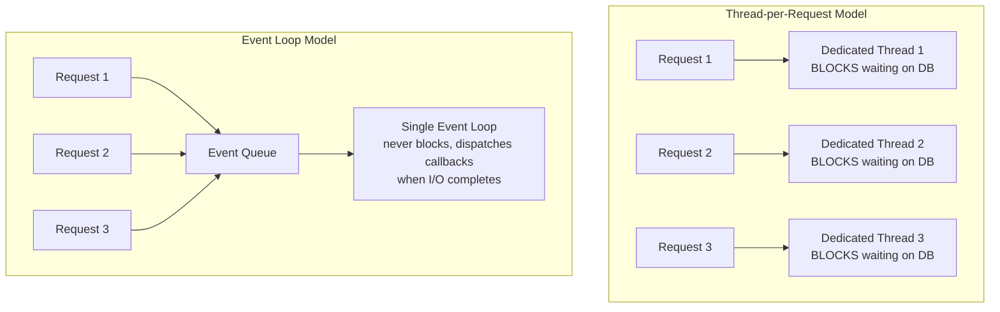
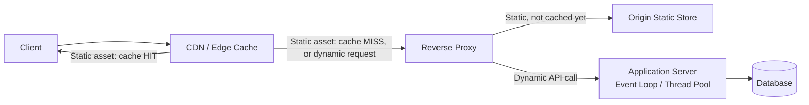

# Diagrams: Web Server Internals

## 1. The Web Server's Core Loop

*Every web server repeats this loop for every request — performance and scalability come entirely down to how step 3 ("Process") is handled for many requests concurrently.*

## 2. Thread-per-Request vs Event Loop

*Thread-per-request ties up a full OS thread for the whole duration of a blocking DB call, however long that takes. An event loop dispatches the I/O and moves on, only returning to that request when the response is ready — letting one thread service thousands of "waiting" requests.*

## 3. Where Static vs Dynamic Requests Get Handled

*Static content is intercepted as early as possible — ideally at the CDN — so it never touches the application server's concurrency model. Only genuinely dynamic requests reach the app server and its database.*
