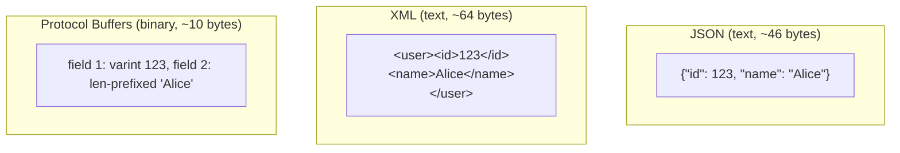
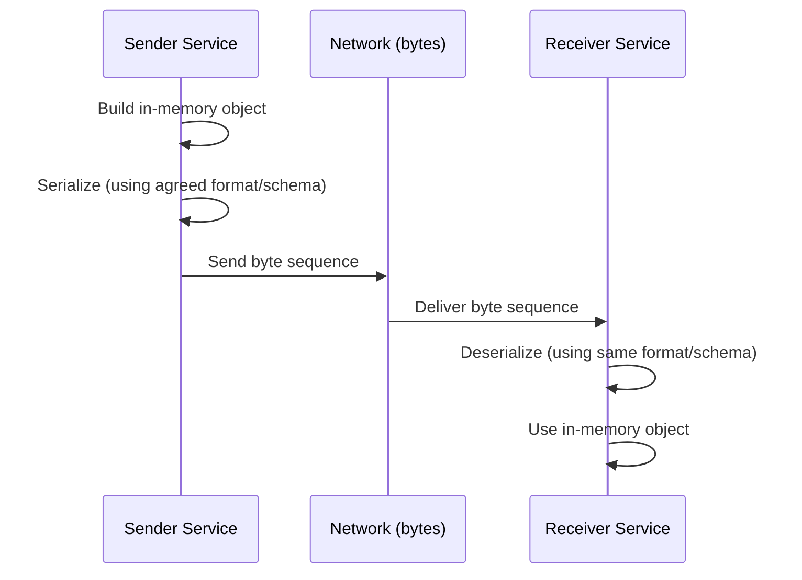
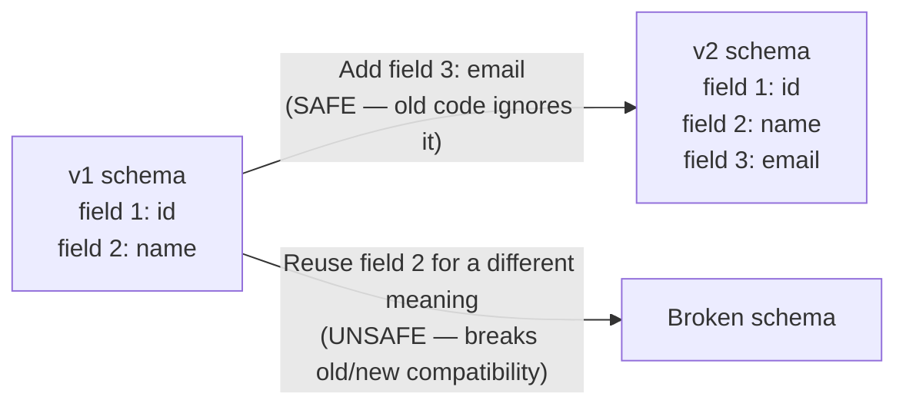

# Diagrams: Message Formats — JSON, XML & Protocol Buffers

## 1. The Same Message in Three Formats

*Same logical data, three encodings — JSON and XML repeat field names/tags as text on every message; Protocol Buffers replaces names with compact numeric field tags defined once in a shared schema, producing a much smaller payload.*

## 2. Serialization / Deserialization Flow

*Both sides must agree on the exact serialization format ahead of time — that agreement is what "message format" means, whether it's JSON, XML, or a shared `.proto` schema.*

## 3. Protobuf Schema Evolution: Safe vs Unsafe Changes

*Adding a new numbered field is backward compatible — old consumers simply skip a tag they don't recognize. Reassigning an existing field number to mean something new breaks every service still running the old schema.*
