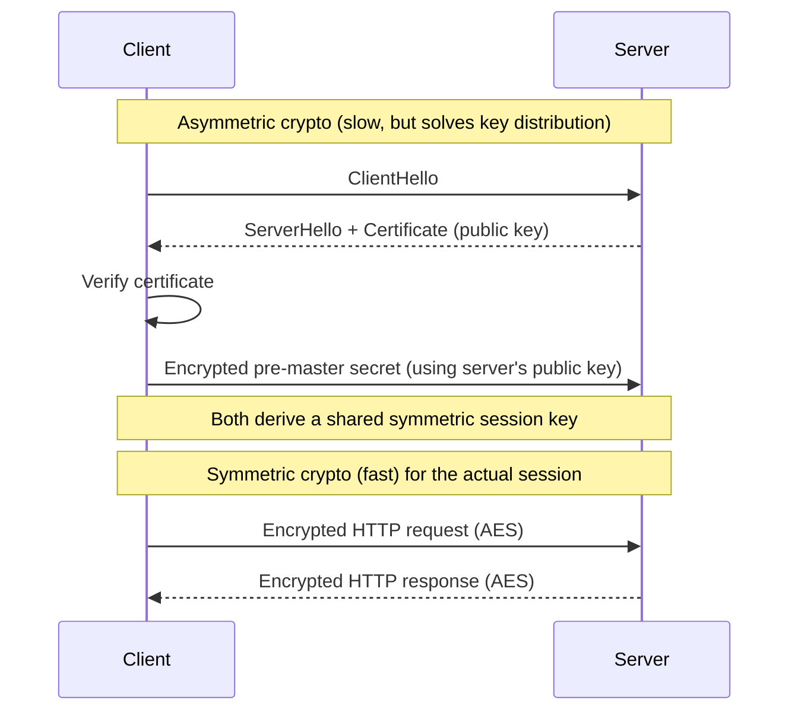
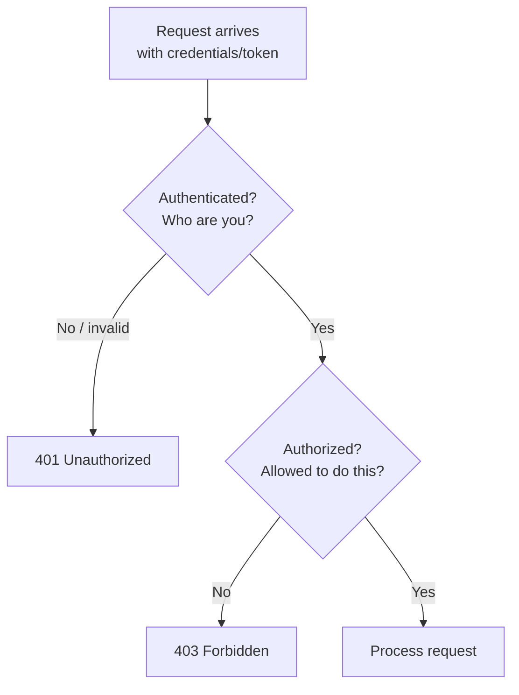
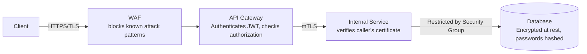

# Diagrams: Security Fundamentals

## 1. TLS: Asymmetric Handshake, Then Symmetric Session

*Asymmetric encryption is used only briefly, to safely agree on a key without needing to share a secret in advance. Once that's done, the fast symmetric algorithm (AES) encrypts everything else.*

## 2. Authentication vs. Authorization in One Request

*Authentication always happens first — you can't check permissions for someone you haven't identified. 401 means identity failed; 403 means identity succeeded but permission didn't.*

## 3. Defense in Depth Across a Request's Path

*Each layer assumes the ones before it might fail: TLS protects data in transit even if the WAF misses something, the gateway still checks authorization even though TLS already ran, mTLS still verifies the caller even inside the "trusted" internal network, and the database is still protected by network rules and encryption even if a service is compromised.*
