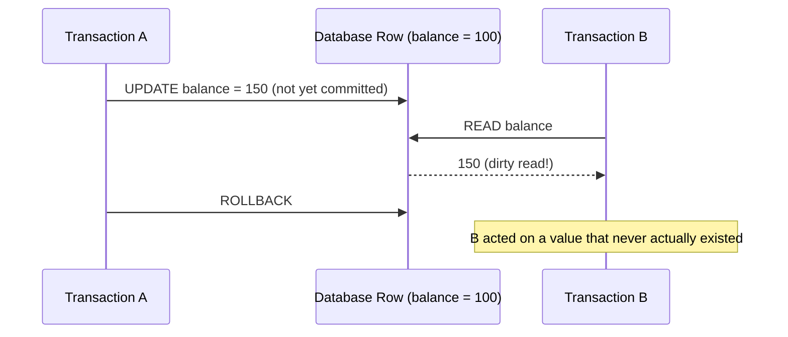
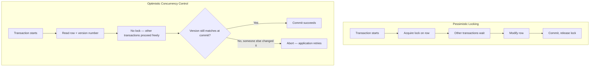
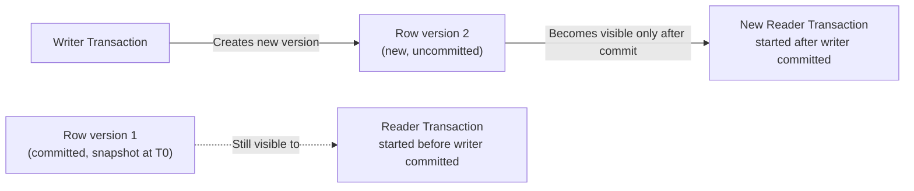

# Diagrams: Transaction Isolation Levels & Concurrency Control

## 1. A Dirty Read Anomaly

*Under Read Uncommitted, B can read a value A never actually committed — if A rolls back, B has already used data that never really existed.*

## 2. Pessimistic Locking vs. Optimistic Concurrency Control

*Pessimistic locking blocks contenders upfront; optimistic concurrency lets everyone proceed and only checks for a conflict right before committing, retrying if one is found.*

## 3. MVCC: Readers See a Consistent Snapshot, Writers Don't Block Them

*A reader that started before the writer's commit keeps seeing the old, consistent version of the row — it never blocks waiting for the writer, and the writer never blocks waiting for it.*
