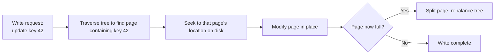
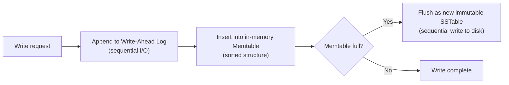
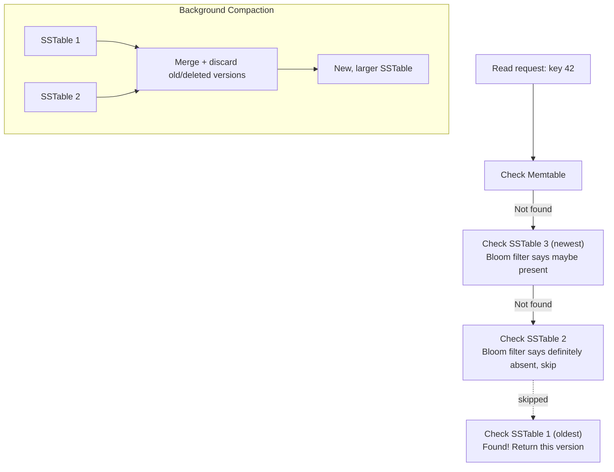

# Diagrams: LSM Trees vs. B-Trees

## 1. B-Tree Write Path: Seek and Modify In Place

*Every write requires finding the specific page holding that key, then modifying it in place — a random-access operation that can occur anywhere on disk.*

## 2. LSM Tree Write Path: Append Only

*Every write is a sequential append — to the write-ahead log and the in-memory memtable — with no seeking to a specific disk location required.*

## 3. LSM Tree Read Path and Compaction

*A read checks the memtable, then SSTables from newest to oldest, using Bloom filters to skip SSTables that provably don't contain the key. Compaction runs in the background, merging SSTables and discarding stale/deleted data to keep read amplification and space usage in check.*
