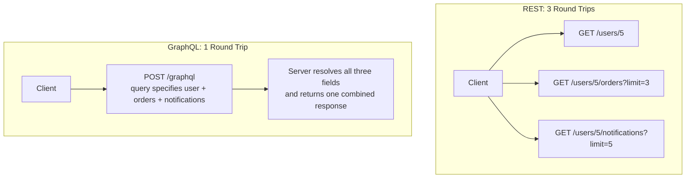
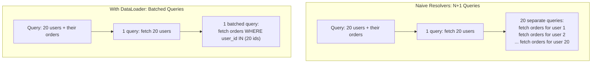
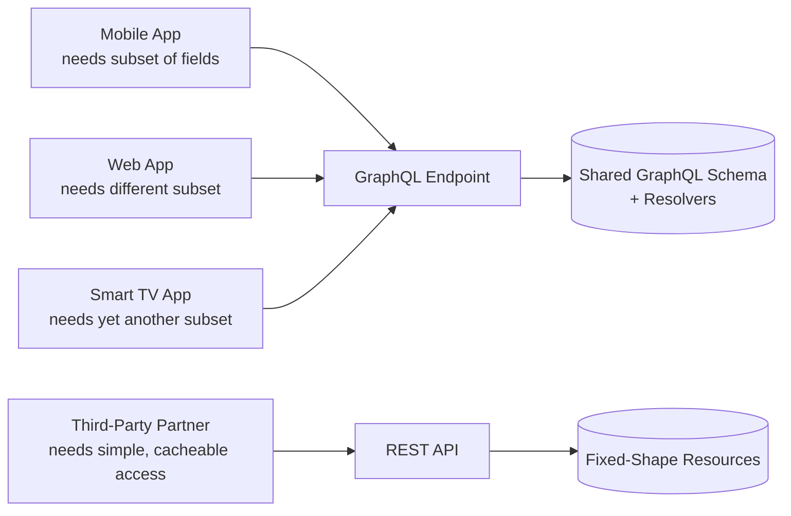

# Diagrams: GraphQL vs. REST

## 1. Under-Fetching in REST vs. One GraphQL Query

*Assembling data from multiple resources for one screen costs multiple REST round trips, or one GraphQL query that specifies the whole combined shape upfront.*

## 2. The N+1 Query Problem and Batching

*Naive per-field resolvers can trigger one query per item in a list. Batching collects all requests for the same data type within one query execution into a single call.*

## 3. Where Each API Style Fits

*Multiple client types with different, evolving data needs share one GraphQL schema efficiently; a single external partner needing simple, cacheable, well-documented access is often still better served by REST.*
