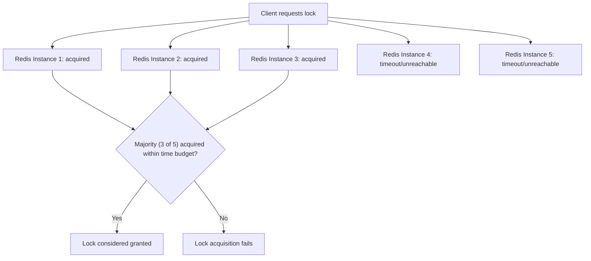
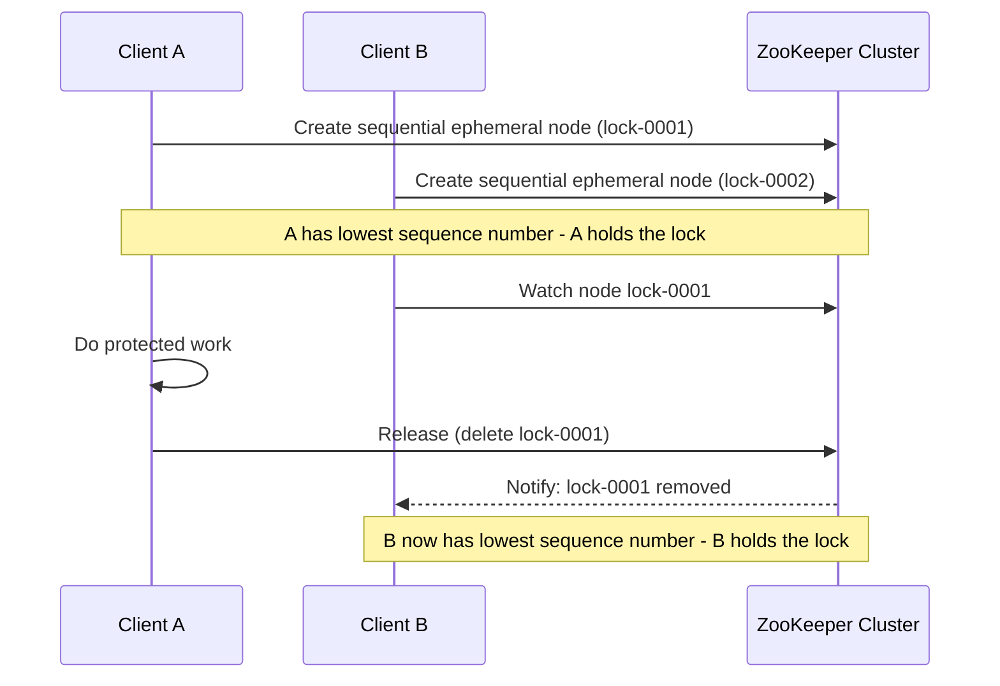
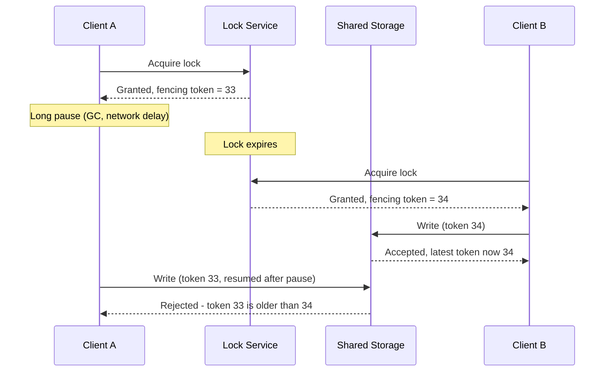

# Diagrams: Distributed Locking

## 1. Redlock: Majority Across Independent Redis Instances

*Redlock only needs a majority of independent instances to agree, so it tolerates some instances being slow or unreachable — the trade-off is that its safety depends on timing assumptions across those instances.*

## 2. ZooKeeper-Style Lock via Sequential Ephemeral Nodes

*Each contender creates a sequential node; whoever has the lowest number holds the lock, and the next-in-line watches for it to disappear — either on release or automatically if that client's session dies.*

## 3. The Fencing Token: Preventing a Stale Holder from Causing Damage

*Even though Client A's lock check originally succeeded, its stale fencing token is rejected at the point of actually writing — the resource itself, not just the lock, enforces correctness.*
