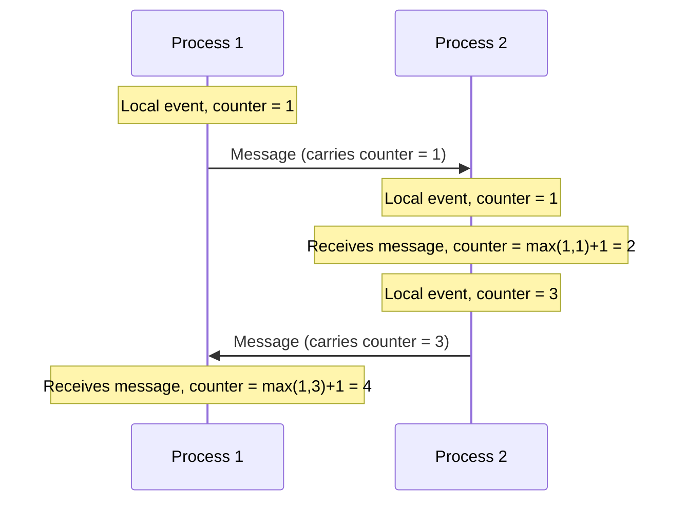
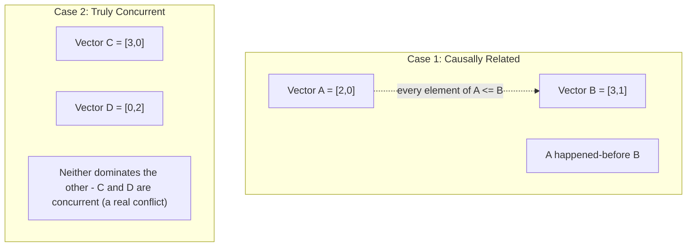
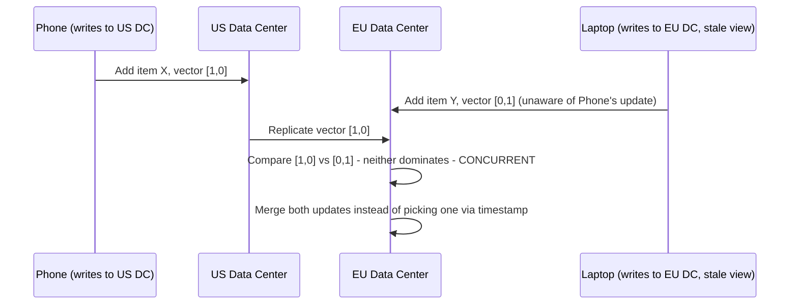

# Diagrams: Logical Clocks & Time in Distributed Systems

## 1. Lamport Timestamps: Happened-Before Ordering

*Every local event increments a process's own counter; receiving a message bumps the counter above both the local and received values — guaranteeing any causally-earlier event gets a smaller number.*

## 2. Vector Clocks: Detecting True Concurrency

*If one vector dominates the other in every slot, the events are causally ordered. If neither dominates, the events happened independently — a genuine conflict, not something a single "which came first" answer can resolve.*

## 3. Vector Clocks Resolving a Shopping Cart Conflict

*Because neither write's vector clock dominates the other, the system correctly identifies this as a genuine conflict and merges both changes rather than silently discarding one based on an untrustworthy wall-clock timestamp.*
