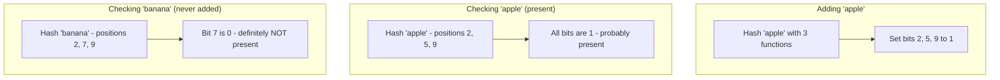
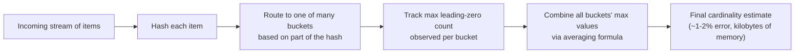
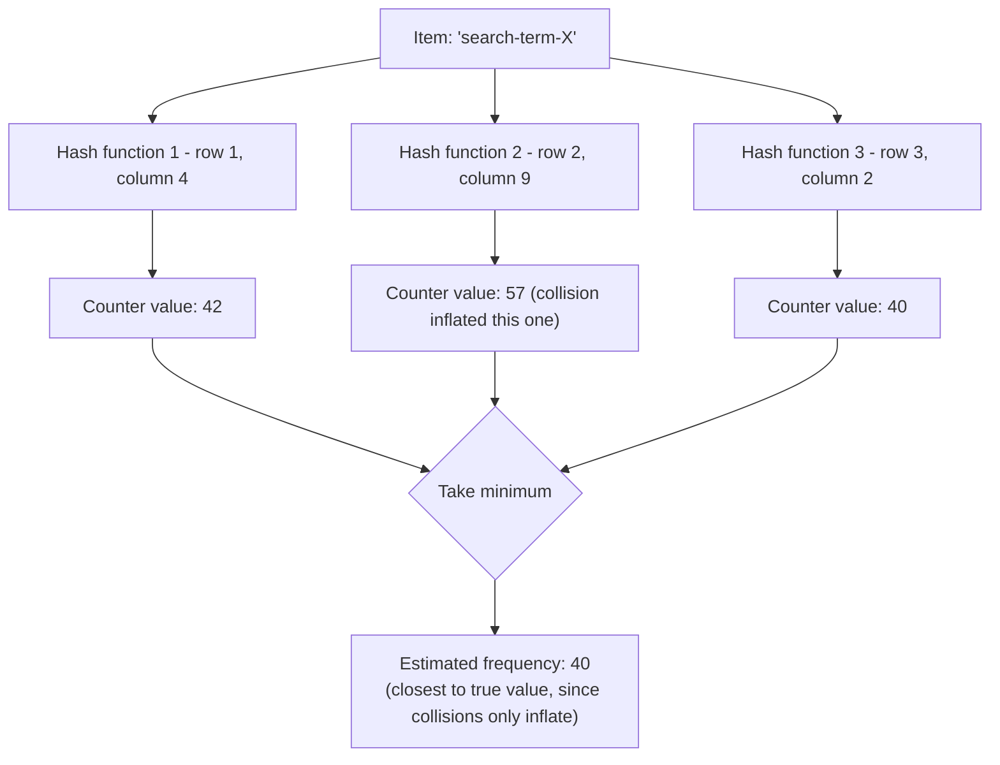

# Diagrams: Probabilistic Data Structures

## 1. Bloom Filter: Add and Check

*Adding an element only ever sets bits — checking membership relies on all relevant bits being set. One zero bit proves absence with certainty; all-ones only proves probable presence.*

## 2. HyperLogLog: Estimating Cardinality from Leading Zeros

*Longer runs of leading zeros in observed hash values are statistical evidence of having hashed more distinct items — HyperLogLog turns that statistic into a compact cardinality estimate.*

## 3. Count-Min Sketch: Estimating Frequency

*Each hash function points to a different row's counter for the same item; taking the minimum across all of them filters out the inflation caused by collisions with other items, since collisions can only ever increase a counter, never decrease it.*
